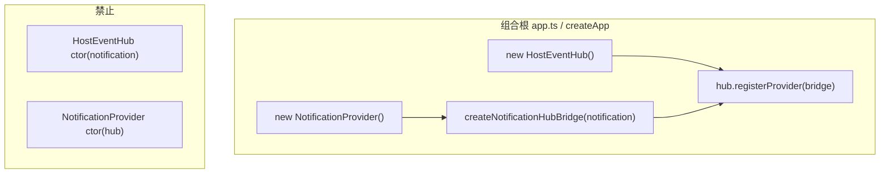

# host-api：Class 化与显式依赖注入 — 需求说明

> **需求与团队约定**：与《宿主-插件通信总线》《host-event-hub_providers_设计》配套阅读。**§1.1～§3** 部分保留早期讨论稿表述；与当前代码（如 **`new HostEventHub(notificationProvider)`**）不一致处，以 **§6**、**§5**（验收）及仓库实现为准。

## 1. 背景与目标

- 将隐式「模块导出单例 + 跨层静态 `import`」改为 **Class 实例 + 在应用入口显式 `new` 与注入**。

- 提升可测试性（可替换依赖）与依赖方向可读性。

- **后续新增宿主侧能力优先采用 class + 构造函数（或工厂参数）显式传参**，避免再增加「全项目静态 import 单例/全局函数」的调用链。

## 1.1 架构原则（已决）：Host Event Hub 与 Notification 同属 `providers/`，且 **Provider 互不注入**

| 原则 | 说明 |

|------|------|

| **位置** | **`HostEventHub`（及 topics、类型）** 从 `services/host-event-hub` **迁入** `apps/host-api/src/providers/host-event-hub-provider/`**（与现有接线文件同树或子目录重组，由实现 PR 定目录细节）**。 |

| **对等** | **`NotificationProvider`** 在 `providers/notification-provider/`；**`HostEventHub`** 在 `providers/host-event-hub-provider/`。二者均为宿主侧 **Provider 级** 单元（与「业务 services」区分的是：对外呈现为可替换、在入口组装的边界）。 |

| **禁止** | **`NotificationProvider` 与 `HostEventHub` 之间构造期互不注入**：任一方的 **构造函数（及同类生命周期初始化）** 不得接收对方类型（或封装了对方的对象）。**禁止** `new HostEventHub(notificationProvider)`，也 **禁止** `new NotificationProvider(hostEventHub)`。 |

| **允许** | **组合根**（`createApp` / `app.ts`）先分别 `new` 两边，再通过 **`HostEventHub.registerProvider(...)`** 注册 **Bridge**（实现 `HostHubProvider` 的薄对象），在 **`attach(registrar)`** 内 `registerSink`，Sink 闭包中调用 **`notificationProvider.dispatch(...)`**（方法名以实现为准）。Bridge 由 **工厂函数**在组合根调用时创建，**不是**与二者对等的「第三个需互注的 Provider」。 |

| **依赖方向（推荐）** | **Bridge 文件**可放在 `providers/host-event-hub-provider/` 下（与当前 `notification-hub.provider.ts` 位置一致），依赖方向：**Bridge → Hub 类型 + NotificationProvider 实例引用**；**`HostEventHub` 类本体** 仍 **不** `import` 通知运行时实现（与 §3.2 一致）。 |

## 2. 范围（本需求覆盖的代码）

### 2.1 通知模块迁移与 Class 化

- **目录**：`apps/host-api/src/services/notification/` **迁移至**  

  `apps/host-api/src/providers/notification-provider/`。

- **实现形态**：使用 **class**（例如 `NotificationProvider`）封装：

  - 原 `notification-bus.service.ts` 中的订阅者集合、`subscribe`、`dispatch`（语义不变：向常驻 Notification SSE 订阅者投递）。

  - **构造函数不得**接收 `HostEventHub` 或其它 Provider 对等物（见 **§1.1**）。

- **经 Hub 发布到常驻 SSE**（原 `publishToNotificationStream`）：

  - **不得**在 `NotificationProvider` 内保存 Hub 引用作为 ctor 注入。

  - 由 **组合根** 创建 **`HostEventPublisher` 窄接口**（例如 `{ publish(input: HostHubPublishInput): void }`）或 **具名工厂** `createPublishNotificationStream(hub)`，注入到 **scheduler / 其它 service**；或保留极薄模块函数但 **首次绑定** 在 `createApp` 内完成（避免全局未绑定单例）。

### 2.2 Host Event Hub Class 化（无对端 Provider 构造注入）

- **目录**：`apps/host-api/src/services/host-event-hub/` **迁入**  

  `apps/host-api/src/providers/host-event-hub-provider/`（与现有 `notification-hub.provider.ts`、`index.ts` 合并整理；避免重复目录名冲突，实现 PR 中一次性调整 import 路径）。

- **实现形态**：**class** `HostEventHub`，保留 `registerProvider`、`publish` 等与现有 `HostHubProvider` / `HostHubRegistrar` / `HostHubPublishInput` 契约对齐的行为。

- **构造函数**：**不**接收 `NotificationProvider`；**不**接收任何「另一宿主 Provider」实例。仅允许通用、非对端 Provider 的配置（若有），在文档与代码中写清。

### 2.3 Bridge（HostHubProvider）与组合根

- **Bridge**（如 `createNotificationHubBridge(notification: NotificationProvider): HostHubProvider`）：

  - 在 **`attach`** 中向 Hub 注册 Notification topic 的 Sink，Sink 内调用 `notification.dispatch(...)`。

  - 由 **`createApp`**：`hub.registerProvider(createNotificationHubBridge(notification))`。

- **取代**原先文档中「Hub 构造注入 `INotificationDispatch`」表述：送达通知订阅者的路径 **仅经** `registerProvider` 注册的 Sink，**Hub 类无对 NotificationProvider 的字段依赖**。

### 2.4 路由与入口组装

- **`registerNotificationRoutes(app, notificationProvider)`**：路由只依赖传入的 `NotificationProvider`。

- **`createApp` / `app.ts`**：

  - `notificationProvider`、`hostEventHub` 均在组合根 `new`；

  - 注册 Bridge、注册其它 Hub Provider、将 `hub` 或窄接口注入 scheduler 等；

  - **`registerAllHostEventHubProviders`**：改为 **`registerHostEventHubProviders(hub, ...)`** 或等价，**入参必含 `hub` 实例**；内部 **禁止** 引用未传入的全局 Hub。

### 2.5 其它调用方

- 例如 `scheduler-observer`：注入 **`HostEventPublisher`** 或上面工厂返回的发布函数，**禁止**静态依赖未组装的模块级 `publish`。

## 3. 待决议项

### 3.1 循环依赖 / 端口策略（已由 §1.1 取代）

- **已废止**：在 **Provider 对等** 前提下，**不再采用**「`new HostEventHub(notificationDispatch)` 方案 B」这种 **Hub 构造期持有通知端口** 的表述。

- **现行策略**：**零交叉构造注入** + **组合根 + `HostHubProvider` Bridge**（Sink 闭包调用 `notificationProvider.dispatch`）。

### 3.2 类型与分层

- [ ] `HostEventHub` 类本体对 `NotificationEvent` 仍保持 **仅 `import type`**，运行时不 `import` `notification-provider` 实现文件（与既有 README 精神一致）。

### 3.3 Bridge 文件位置

- [ ] 保留在 `providers/host-event-hub-provider/*-bridge*.ts`（推荐，与 Hub 同树）/ 或迁至 `providers/notification-provider/`（会引入 notification → hub 类型依赖，需评估）。**实现后勾选**。

## 3.4 `HostEventHub.publish` 的「显式传递」（不变）

| 层面 | 结论 |

|------|------|

| **对内** | **`publish` 为 `HostEventHub` 实例方法**；不把「publish 实现」再注入进 Hub。 |

| **对外** | 调用方通过 **构造函数注入 `hostEventHub` 或 `HostEventPublisher` 窄接口**；避免长期模块级 `export function publish`。 |

## 4. 非目标

- 不要求一次性将整个 `host-api` 全部改为 class。

- 不要求引入第三方 IoC 容器。

## 5. 验收标准

- `services/notification`、`services/host-event-hub` 移除或仅短期 re-export（PR 写明删除点）。

- `notification.routes.ts` 仅通过参数使用 `NotificationProvider`。

- **`NotificationProvider` 构造器不接收 `HostEventHub`**；**`HostEventHub(notificationProvider)`** 于内部挂载 Notification Bridge；其它域通过 **`hub.registerProvider`** 显式注册。

- `pnpm lint:arch` 通过。

- `apps/host-api/src/providers/host-event-hub-provider/README.md`（迁移后路径）、`docs/项目功能/宿主插件通信总线/host-event-hub_providers_设计.md` 随实现 PR 同步。

## 6. 后续开发约定（host-api，**尽量遵守**）

### 6.1 类 + 显式传参 + 显式调用（优先于模块级单例）

- **尽量**用 **class** 表达有状态、有生命周期或将来可能需要多实例 / 可替换实现的宿主侧单元（如 `providers/*-provider`、`HostEventHub` 及对等协作对象）。
- **依赖一律显式传入**：通过 **`constructor` 参数**、**工厂函数入参** 或 **`createApp` 内局部变量**向下传递；调用方手握 **实例引用** 再调方法（**显式调用**），**避免**再增加「本文件 `import { fn } from '…'` 即隐式依赖某处已初始化的模块单例」的链路。
- **组合根**：在 **`apps/host-api/src/app.ts` 的 `createApp`**（或日后抽离的 **`composeHostDeps()`**）集中完成 **`new`、传参、`register*(app, deps)`**；**routes / controllers** 只做映射与包装，**不**承担组装职责。
- **窄接口跨层传递**：例如只注入 **`HostEventPublisher`**（`{ publish }`）而非在无关模块中 import 整颗 Hub；参见 **§3.4**（`publish` 不把实现再「注入进」Hub 内部）。

### 6.2 模块级状态与过渡写法

- **避免**新增 `let` + `export function register…` 的半全局拼装（若确有，须在 PR 写明 **deprecation 与移除条件**）。
- **scheduler 等横切能力**：优先 **构造函数注入**发布函数或端口（与当前 `registerSchedulerNotificationPublisher` 同类思路）；不在业务深处直接依赖未绑定的裸 `import`。

### 6.3 与「Provider 构造依赖」的当前口径（与 §1.1 历史稿校准）

- **`NotificationProvider`**：**仍不**在构造期接收 `HostEventHub`。
- **`HostEventHub`**：**构造期接收 `NotificationProvider`**，并在内部 **`registerProvider(createNotificationHubBridge(…))`**，固定常驻 Notification 路径。
- **其它业务域** 接 Hub：**仍在组合根** **`hub.registerProvider(createXxxBridge(…))`** 显式注册，避免 Hub 内堆积过多域运行时 `import`。

### 6.4 不在本节约束范围内的代码

- **插件运行时**仍遵循 `plugin.json` / `AGENTS.md` 插件章；**前端 host-console** 仍遵循现有 pages / features 分层。

## 7. 相关文档索引

- `docs/项目功能/宿主插件通信总线/宿主-插件通信总线_设计文档.md`

- `docs/项目功能/宿主插件通信总线/host-event-hub_providers_设计.md`

- `AGENTS.md`

