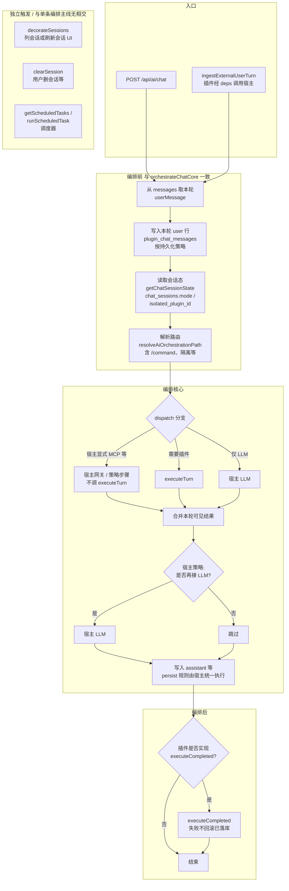

# 插件实例：对外方法 / 钩子与编排流程

本文描述 **插件运行时契约与宿主编排关系**。

- **类型包**：`@wclaw/plugin-sdk`（`packages/plugin-sdk`）——契约为 **`executeTurn`** / **`executeCompleted`** 等与编排文档一致；宿主与插件均依赖此单一包。

---

## 1. 正交关系（与会话列表、清会话）

- **`executeTurn`**：仅处理「给定 `pluginId` + `sessionId` + 本轮输入」的一次业务回合，返回回复及可选 `persist`、流式回调等。**不参与**会话列表如何展示，**不**承担删会话语义。
- **`decorateSessions`**：仅在宿主需要**丰富会话列表展示**时调用（标题、`persistence` 等），与单次 **`executeTurn` 无调用关系、无相交**。
- **`clearSession`**：用户或宿主触发「清除某会话」时调用，与 **`executeTurn` 无相交**。

**`command_plugin` 与 `runtime_plugin` 的差异（本会话模型）**：

- `command_plugin`：产品/数据上通常等价于 **单会话**；一般**不依赖** `decorateSessions` 做多会话编排；若实现该方法，仅作用于列表层展示，仍与 `executeTurn` 正交。
- `runtime_plugin`：可为 **`sessionProvider.mode=multi`**；**各账号/各会话**由 **`executeTurn`** 逐条处理；**列表里每个会话长什么样**由 **`decorateSessions`** 决定，仍与单次 `executeTurn` 无相交。

---

## 2. 插件实例：对外方法 / 钩子（目标契约）

| 符号 | 方法（目标名） | 角色 | 说明 |
|------|----------------|------|------|
| 构造 | `constructor(deps)` | 宿主注入依赖 | `deps` 含 `pluginId`、`publish`；可选 **`ingestExternalUserTurn`**（由宿主提供，供进线/轮询等触发与 HTTP Chat **同源**编排）。 |
| ① | **`executeTurn`** | 唯一「一轮输入」入口 | 合并原「聊天回合」与「命令 argv」语义；宿主在解析路由后调用。**可选实现**（由 `plugin.json` / capabilities 约束宿主是否必须存在）。 |
| ② | **`executeCompleted`** | 编排成功落库后的收尾 | 将本轮 assistant 等结果 **回流外部渠道**（如微信单聊）。失败 **不回滚** 已落库内容。 |
| ③ | **`decorateSessions`** | 会话列表增强 | 与 ① **正交**；宿主列会话时调用。 |
| ④ | **`clearSession`** | 清除指定会话 | 与 ① **正交**；删会话消息与插件侧状态清理约定。 |
| ⑤ | **`getScheduledTasks`** | 声明调度任务 | 与 ① **正交**；启动时由宿主拉取。 |
| ⑥ | **`runScheduledTask`** | 单次调度执行 | 与 ① **正交**；内部可调用宿主注入的 **`ingestExternalUserTurn`** 再进入与 UI 相同的编排链。 |

**说明**：上表 ①～⑥ 在实现上均可为可选方法；宿主根据清单 `capabilities`、`kind` 等决定是否调用（与现有加载器行为一致，仅入口名从 `handleChat` / `executeCommand` 收敛为 **`executeTurn`** 的目标形态）。

---

## 3. 编排流程图（UI 与外部进线同源）

以下从 **「一次进入 `orchestrateChat`」** 视角绘制（与 `apps/host-api/src/services/ai-chat/ai-chat.service.ts` 一致）。`POST /api/ai/chat` 与 **`ingestExternalUserTurn`** 在各自入口拼好 `messages` 后，**进入同一条** `orchestrateChat` 主线。

### 3.1 「编排前」顺序说明（避免与实现相反）

宿主当前实现顺序为：

1. **从 `messages` 取出本轮 `userMessage`**（末尾一条 user 正文）。
2. **按持久化策略写入 `plugin_chat_messages` 的 user 行**（若该会话应落库）。
3. **打点** `chat.request.received`（审计用）。
4. **`getChatSessionState`**：读 **`chat_sessions`** 表里该 `pluginId + sessionId` 的 **编排态**（见下节「会话态」）；无行则视为 `normal`。
5. **`resolveAiOrchestrationPath(state, userMessage)`**：在 **已有 state + 本轮文案** 上决定走隔离、`/command` 信封还是 `runtime_default` 等（**不是**先解析再写库；写 user 在读 state 之前，便于时间线与队列语义一致）。

原流程图若把「读会话态」放在「写 user」之前，会与上述实现不一致，已按实现修正。

### 3.2 「会话态」指什么（不是读聊天记录）

**会话态** = 表 **`chat_sessions`** 中一行，字段语义大致为：

| 字段 | 含义 |
|------|------|
| `mode` | **`normal`**：普通编排；**`isolated`**：已进入某 `command_plugin` 的上下文隔离（本条起 user 全文当作子插件命令等）。 |
| `isolated_plugin_id` | 隔离模式下，当前绑定的 **目标 command_plugin 的 id**；`normal` 时为 `null`。 |

这与 **「读 `plugin_chat_messages` 历史」** 是两件事：前者决定 **本轮路由分支**；后者在别处（如拼 LLM 窗口、进线拼 tail）按需读取。

**读图要点**：

- **`decorateSessions` / `clearSession` / 调度`** 不挂在「从入口到 `executeCompleted`」的主链上，由宿主在**其它时机**调用。
- **是否走隔离、`/command` 分支** 依赖 **`resolveAiOrchestrationPath` 读到的 `state.mode`** 与 **`userMessage`**；**是否再接 LLM** 由宿主策略与 manifest 等决定，**不由插件返回值覆盖**（与产品策略一致时在需求文档中单列一节即可）。

---

## 4. SDK 类型与方法说明（`packages/plugin-sdk/src/runtime-contract.ts`）

### 4.1 构造依赖 `PluginRuntimeExtensionDeps`

| 字段 | 说明 |
|------|------|
| `pluginId` | 当前插件 id。 |
| `publish` | Hub 窄接口，用于多 topic 发布（如通知）。 |
| `ingestExternalUserTurn?` | 宿主注入；外部进线代插 user 后走与 `POST /api/ai/chat` 同源编排；**非插件实现的方法**，由宿主在 `new` 时传入。 |

### 4.2 一轮输入：`PluginTurnContext` / `executeTurn`

| 字段 / 方法 | 说明 |
|-------------|------|
| `PluginTurnContext` | `sessionId`、`message`、`config`、可选 **`argv?: { command, args }`**（宿主已解析命令行时传入）、可选 `emitAssistantDelta` / `emitPluginActivity`。 |
| `PluginTurnHandleResult` | `string \| { reply, persist? }`。 |
| `executeTurn?` | 处理单轮输入；与 **`decorateSessions`** / **`clearSession`** / 调度 **无相交**。 |

### 4.3 编排后回流：`executeCompleted`

| 方法 | 说明 |
|------|------|
| `executeCompleted?` | 入参 **`PluginExecuteCompletedInput`**（`sessionId`、`reply`、`metadata?`、`traceId?`）；编排 **成功落库后** 由宿主调用；失败 **不回滚** 落库。 |

### 4.4 与会话 / 调度正交

| 方法 | 说明 |
|------|------|
| `decorateSessions?` | 会话列表展示增强；**不在**每条 `executeTurn` 主链上调用。 |
| `clearSession?` | 清除指定会话。 |
| `getScheduledTasks?` / `runScheduledTask?` | 调度声明与执行；可内部调用 `ingestExternalUserTurn`。 |

宿主侧 **`ingestExternalUserTurn`** 与 **`POST /api/ai/chat`** 均进入 **`orchestrateChat`**；编排 assistant 落库后由宿主统一调用插件的 **`executeCompleted`**（若实现）；进线元数据经 `reflowMetadata` 传入。详见 `apps/host-api/src/services/ai-chat/ai-chat.service.ts`、`external-user-turn.service.ts`。

---

## 5. 相关文档

- 迁移待办清单：`docs/插件/todo.md`
- 插件类型与命令模式术语：`docs/项目功能/插件/插件.md`
- 插件规范与清单字段：`plugin_spec_v3_插件规范.md`
- SDK 源码与 README：`packages/plugin-sdk/src/runtime-contract.ts`、`packages/plugin-sdk/README.md`
