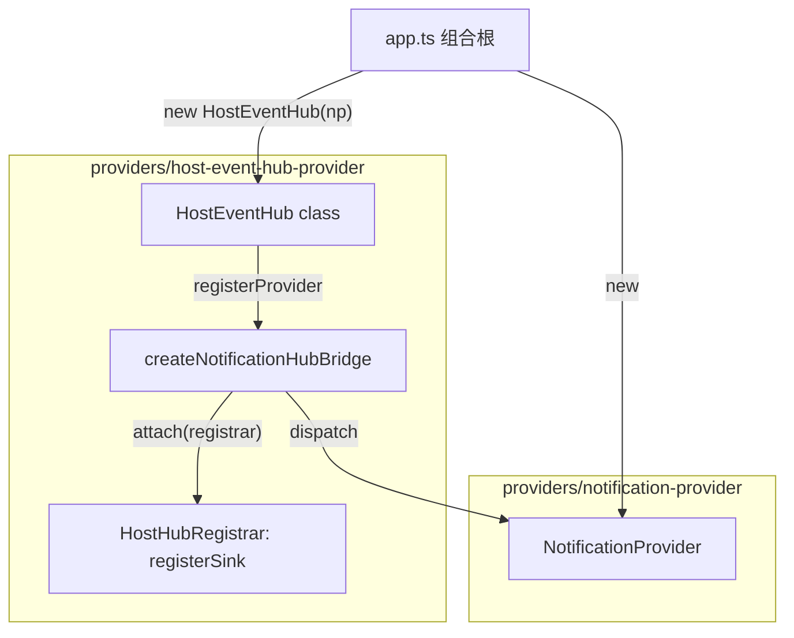

# Host Event Hub — Provider 注入模型

## 1. 核心语义（写死）

- **Host Event Hub**：**class `HostEventHub`**（`providers/host-event-hub-provider/host-event-hub.ts`），组合根 **`new HostEventHub(notificationProvider)`** 时内部自动 **`registerProvider(createNotificationHubBridge(...))`**，并提供 **`publish`** 与 **`registerProvider`**（其它域仍手动注册）。
- **Notification / Chat / Metrics / …**：均为 **Provider**（实现 **`HostHubProvider`**），由组合根对 **已创建的 hub 实例** 调用 **`hub.registerProvider(provider)`**。
- **Provider 接线**：**`providers/host-event-hub-provider/*.provider.ts`**（Bridge 工厂，如 **`createNotificationHubBridge`**）；**`NotificationProvider` 类** 在 **`providers/notification-provider/`**。**Hub 与 `NotificationProvider` 构造期互不注入**；跨域仅在 Bridge 的 `attach` 闭包或组合根完成。

## 2. 问题背景

若把各域接线写在 Hub 核心文件内，Hub 会反向依赖各域运行时，破坏依赖倒置。故将 **「向 Hub 挂载 Sink」** 收敛到 **`providers/host-event-hub-provider/`** 的 Bridge，Hub 核心仅通过 **`HostHubRegistrar.registerSink`** 向 Provider 暴露挂载能力。

## 3. 目录与职责

| 路径 | 职责 |
|------|------|
| `providers/host-event-hub-provider/host-event-hub.ts` | **Hub**：`registerProvider`、`publish`；**不** import 各域运行时（可 `import type` 对齐 payload）。 |
| `providers/host-event-hub-provider/host-event-hub.topics.ts` | **`HOST_EVENT_TOPICS`** |
| `providers/notification-provider/` | **`NotificationProvider`**：`subscribe`、`dispatch`（仅 Hub Bridge Sink 调用）。 |
| `providers/host-event-hub-provider/notification-hub.provider.ts` | **`createNotificationHubBridge(notification)`** → **`HostHubProvider`** |
| `providers/host-event-hub-provider/publish-notification-stream.ts` | **`createPublishNotificationStream(hub)`**：固定 Notification topic 入站 |
| `providers/host-event-hub-provider/index.ts` | 导出 **`HostEventHub`**、`createPublishNotificationStream` 等 |

## 4. 依赖图

## 5. 新增 Provider 步骤

1. 在 **`providers/host-event-hub-provider/<name>-hub.provider.ts`** 导出 **`createXxxBridge(deps): HostHubProvider`**（唯一 **`id`** + **`attach`**）。
2. 在 **`app.ts` 组合根** 中 **`hub.registerProvider(createXxxBridge(...))`**（Notification 已由 **`new HostEventHub(np)`** 自动注册）。
3. 新 topic：在 **`host-event-hub.topics.ts`** 增加 **`HOST_EVENT_TOPICS`** 常量。

**约定**：**Notification** 在 **`HostEventHub` 构造器** 内接线；**新增其它业务域** 时优先 **`createXxxBridge` + `hub.registerProvider`**，避免在 `host-event-hub.ts` 内堆叠过多域运行时 `import`。

## 6. Provider 与 Notification 的关系

- **Bridge ≠ 整个通知域**：Bridge 是 **Hub 扩展单元**；**`NotificationProvider`** 仍是订阅与投递实现，由 Bridge 的 Sink 调用 **`dispatch`**。

## 7. 验收要点

- Hub 核心模块无对各业务域的**值** import。
- 同一 Provider **`id`** 重复 `registerProvider` 为幂等（仅挂载一次）。
