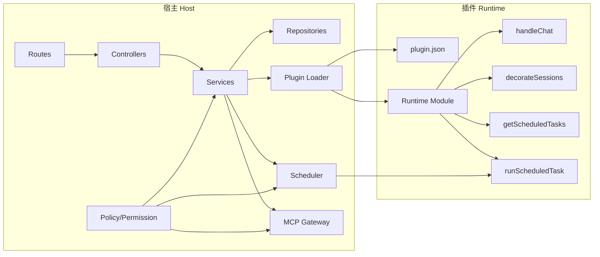
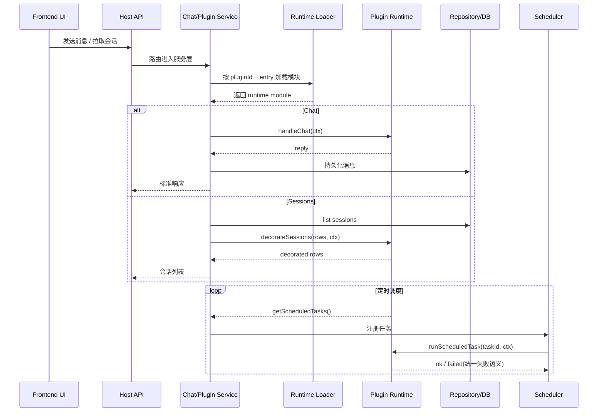

# 插件架构设计（Host-Plugin Architecture）

更新时间：2026-05-09

本文定义 `wclaw-weixing-v3` 中插件体系的架构边界与运行模型，目标是让插件能力可扩展、可治理、可审计，同时保持宿主内核稳定演进。

---

## 1. 设计目标

1. 宿主与插件强解耦：插件不依赖宿主内部实现，仅依赖契约。
2. 能力声明化：插件能力通过 `plugin.json` 显式声明并由 loader 校验。
3. 运行可治理：任务调度、权限、会话协议由宿主统一治理。
4. 扩展可持续：新增插件能力优先通过既有类型内的协议字段扩展，不新增插件类型。

---

## 2. 架构总览

插件架构采用“宿主中心 + 插件声明 + 运行时动态加载”模型。

- 宿主（Host）负责：
  - 插件发现、加载、启停、配置与状态管理
  - 会话路由与消息分发
  - 调度执行（并发、超时、重试、熔断）
  - 权限校验与策略管控
- 插件（Plugin）负责：
  - 按契约导出运行时函数（如 `handleChat`、`decorateSessions`）
  - 在声明能力范围内处理业务逻辑
  - 返回结构化结果与会话元信息

核心边界原则：

- 插件禁止直连 MCP Server（必须走宿主代理能力）。
- 插件禁止 import 宿主内部目录。
- 宿主禁止按 `pluginId` 写业务特判（如 `weixin-bridge` 特判）。

### 2.1 静态分层关系图（Mermaid）

---

## 3. 插件类型与职责

### 3.1 `runtime_plugin`

定位：会话承载与长生命周期能力扩展。

常见能力：
- `kind=runtime_plugin`（宿主按类型进入 runtime chat 路径）
- `sessionProvider.mode=single|multi`
- 可接入宿主调度（如轮询、心跳、状态同步）

典型导出：
- `handleChat`（chat 开启时必需）
- `decorateSessions`（可选，会话展示增强）
- `getScheduledTasks` / `runScheduledTask`（建议）

### 3.2 `command_plugin`

定位：短生命周期命令执行单元。

常见能力：
- `kind=command_plugin`
- `commandMode` 必填，且仅可为：
  - `ephemeral_no_context`
  - `ephemeral_with_context`
  - `isolated_chat`

强约束：
- 不允许声明任何定时任务（包括低频定时任务）。

#### `commandMode` 在宿主 AI Chat 中的行为（`AiChatCommandEnvelope`）

「是否有斜杠命令」由宿主解析：长格式 `/command <pluginId> [args]`，短格式 `/xxx`（以当前会话上下文解析目标插件，**隔离态下**以 **隔离目标插件 id** 作为短命令的“虚拟 host”，见源码注释）。

| `commandMode` | 用户仅发送普通文本（无斜杠命中） | 用户发送可解析的斜杠命令 |
|----------------|-----------------------------------|---------------------------|
| `ephemeral_no_context` | 固定提示用法，**不**调用 `executeTurn`，**不**走宿主 LLM | `runPluginCommand` → `executeTurn` |
| `ephemeral_with_context` | 仅走 **宿主 LLM**：注入插件 `systemPrompt`、按清单声明挂载 MCP 工具、带入窗口内历史；**不**先执行插件 | 同上，先 `executeTurn`，再根据模式决定是否带命令输出继续走 LLM |
| `isolated_chat` | 与 `ephemeral_with_context` **相同**（宿主会话下：无斜杠则纯 LLM） | 首次命中 `isolated_chat` 目标时可 **进入隔离**（见 `ai-chat-host-command`）；隔离内规则见下行 |
| （隔离态 `isolated`） | 与上表「带上下文」一致：无斜杠 → 仅 LLM，manifest 取 **隔离目标插件** | 有斜杠 → `executeTurn`（`host_command`） |

`runtime_plugin` 若会话行 `forceExecuteTurn === true`，则**无斜杠也将全文作为命令**走 `host_command`（与 command 插件默认策略区分）。

---

## 4. 插件生命周期

1. 发现：扫描 `plugins/*/plugin.json`
2. 校验：JSON Schema + 语义规则
3. 加载：按 `entry` 动态 `import()`
4. 激活：进入 `active`，接入路由/会话/调度
5. 运行：处理 chat/command/session/scheduler 调用
6. 变更：配置热更新、能力重评估
7. 卸载：注销任务、清理资源、切换状态

状态建议：
- `discovered` → `validated` → `loaded` → `active` → `disabled|failed|unloaded`

---

## 5. 运行时调用链（简化）

### 5.1 Chat 调用链

`Host Route -> Controller -> Service -> Plugin Runtime(handleChat) -> Repository`

说明：
- 插件只处理业务语义，不直接操作宿主分层对象。
- 宿主负责消息持久化与统一响应格式。

### 5.2 会话列表调用链

`Host Service(list sessions) -> Plugin Runtime(decorateSessions) -> Host normalize`

说明：
- `decorateSessions` 用于会话展示增强，不承载宿主策略逻辑。
- 宿主最终做最小规范化（如默认标题、字段兜底）。

### 5.3 调度调用链

`Plugin getScheduledTasks -> Host scheduler-registry -> scheduler-runner -> Plugin runScheduledTask`

说明：
- 调度治理（超时/重试/退避/熔断）由宿主统一负责。
- 当前阶段 `runScheduledTask` 失败语义不区分业务失败与可重试失败，统一按“任务执行失败”处理。

### 5.4 运行时时序图（Mermaid）

---

## 6. 会话协议与展示扩展

会话基础字段：
- `sessionId`（稳定唯一）
- `title`（展示名）
- `updatedAt` / `active`（由宿主视图决定）
- `meta`（可选）

`meta` 规则：
- 必须遵循 `sessionProvider.sessionMetaSchema` 白名单。
- 未声明字段由宿主忽略（建议记录调试日志），避免协议漂移。

---

## 7. 微信桥健康分级协议（展示层扩展）

微信桥仍是 `runtime_plugin`，不新增插件类型。

通过 `decorateSessions` 返回 `meta.health` 表达健康分级：

- `level`: `healthy | degraded | unhealthy | unknown`
- `reasonCode`（可选）：如 `QR_EXPIRED`、`OFFLINE`、`SYNC_DELAY`
- `lastHeartbeatAt`（可选）：ISO 时间
- `actionHint`（可选）：建议动作（如“重新扫码”）

前端展示约定：
- `healthy`：绿色，可用
- `degraded`：黄色，可用但受限
- `unhealthy`：红色，不可用或需恢复
- `unknown`：灰色，未知或初始化中

---

## 8. 权限与安全模型

1. deny-by-default：未声明权限即无权限。
2. 高风险权限需策略确认：`exec.command`、`network.write`、`context.global.write`。
3. 插件入口路径禁止越界（拒绝 `../`）。
4. 审计字段建议统一：`traceId/pluginId/sessionId/taskId`。

---

## 9. 演进策略

1. 优先扩展协议字段，不新增插件类型。
2. 新能力需同步更新：
   - `插件规范.md`
   - 本文档（插件架构设计）
   - 对应功能专项文档（如调度、消息流）
3. 规则落地顺序：
   - 文档约束 -> loader 语义校验 -> 前端渲染协议 -> 运行时观测与告警

---

## 10. 实施检查清单（架构视角）

- 是否存在宿主按 `pluginId` 特判逻辑？
- `command_plugin` 是否被错误赋予定时任务能力？
- `decorateSessions` 返回字段是否经过 `sessionMetaSchema` 白名单约束？
- 微信桥健康分级是否通过协议字段表达，而非类型分叉？
- 调度任务是否全部由宿主 Scheduler 接管？

