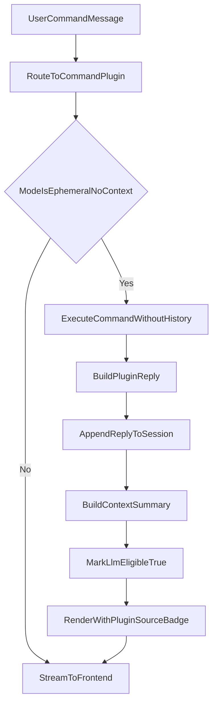

# command_plugin_ephemeral_no_context消息流程

## 适用范围

- 本文仅适用于 `command_plugin` 且执行模式为 `ephemeral_no_context` 的消息流程。
- 该流程既适用于插件独立 chat 入口，也适用于被 `runtime_plugin` 编排调用时的单步执行。

## 目标

- 明确 `ephemeral_no_context` 在“执行阶段不带上下文”的约束。
- 明确执行结果如何回流并并入后续 `runtime_plugin` 的 LLM 上下文。
- 明确消息来源标记与前端展示规则。

## 核心规则（已确认）

1. 执行输入规则  
   - 命中 `command_plugin` 命令后，执行器只使用“本次命令输入”作为主输入。
   - 插件执行阶段不读取历史对话上下文（`no_context` 语义）。

2. 输出回流规则  
   - 插件执行结果必须回流当前会话并展示给前端。
   - 回流消息必须带来源：`sourceType=plugin`、`sourcePluginId=<pluginId>`。

3. 后续上下文并入规则  
   - 虽然执行时不带上下文，但执行结果在回流后默认 `llmEligible=true`。
   - 后续若会话回到 `runtime_plugin` 默认 LLM 路径，该结果应并入 LLM 上下文。
   - 结构化输出使用 `contextSummary` 并入，不直接拼接原始大 JSON。

4. LLM 与 MCP 规则  
   - `ephemeral_no_context` 本次命令执行不直接走 LLM 推理链。
   - `ephemeral_no_context` 本次命令执行不依赖 MCP 工具链。
   - 回流结果可在后续普通消息的 LLM 阶段被利用（由上文 `llmEligible/contextSummary` 决定）。

## 消息模型建议（本流程关注字段）

- `messageId`
- `role` (`user|assistant|system`)
- `content`
- `sourceType`（固定为 `plugin`）
- `sourcePluginId`
- `llmEligible`（默认 `true`）
- `contextSummary`（结构化结果摘要）
- `createdAt`

## 流程图

## 前端展示要求

- 回流消息底部展示来源标签，例如：
  - `来源: plugin:workspace-echo`
  - `来源: plugin:weixin-bridge`
- 若该消息由 `ephemeral_no_context` 路径产生，可附加轻量标识（可选）：
  - `模式: no_context`

## 实施注意事项

- 不得因为 `no_context` 就丢弃回流消息；回流消息必须进入会话历史。
- 不得写 `pluginId` 特判分支；按清单模式驱动分流。
- services 层不依赖 web 层对象，保持编排与协议解耦。
- 落库时保留 `traceId/sessionId/pluginId`，保证审计可追踪。

## 建议实施阶段（最小可用）

1. 支持 `ephemeral_no_context` 单步执行内核  
2. 回流消息统一标记 `source` 与 `llmEligible/contextSummary`  
3. 在后续 `runtime_plugin` 普通消息走 LLM 时验证并入效果
