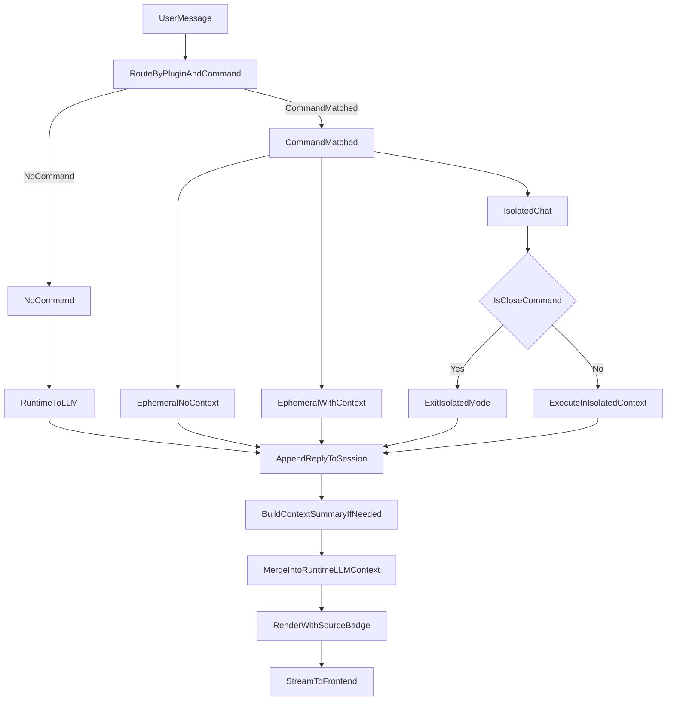

# chat消息流程

## 适用范围

- 本文仅适用于 `runtime_plugin` 类型的会话流程。
- `command_plugin` 作为独立入口的完整 chat 生命周期不在本文展开，但其“独立 chat 内核能力”是本文流程的前置依赖。

## 目标

- 统一 `runtime_plugin` 类型 chat 的执行路径与上下文并入规则。
- 明确 `command_plugin` 三种模式在消息回流与 LLM 上下文中的行为。
- 要求消息带来源标记，前端在消息底部显示来源标签。

## 核心规则（已确认）

1. 默认路径  
   - `runtime_plugin` 接收消息时，若未命中任何插件命令，默认走 LLM。

2. 命令插件执行与回流  
   - `command_plugin (ephemeral_no_context)`：执行命令并回流消息。  
   - `command_plugin (ephemeral_with_context)`：执行命令（可带上下文）并回流消息。  
   - `command_plugin (isolated_chat)`：进入该 `command_plugin` 的独立 chat 上下文，执行并回流消息，`/close` 退出隔离并返回 `runtime_plugin` 上下文。  

3. 上下文并入（关键）  
   - 只要是插件执行完毕后回流的消息（包括 `isolated_chat` 退出后的回复消息），都并入 `runtime_plugin` 后续 LLM 上下文。  
   - 结构化输出按 `contextSummary`（B 方案）并入 LLM 上下文，不直接原样拼接大 JSON。

4. 消息来源标记（后端+前端）  
   - 每条消息必须标记来源：`runtime` 或 `plugin:<pluginId>`。  
   - 前端在消息底部展示来源标签，便于用户理解“这条回复由谁产生”。

5. MCP 工具规则  
   - MCP 工具按通用 AI chat 能力启用，不与单一插件强绑定。  
   - `isolated_chat` 隔离期间，`runtime_plugin` 启动时启用的 MCP 工具不生效（按隔离态规则执行）。

6. 先后实现关系（关键）  
   - 要先具备 `command_plugin` 的独立 chat 内核（最小可调用版本），`runtime_plugin` 才能稳定编排调用。  
   - 不是先做完整 `command_plugin` 产品形态，而是先做可复用的执行内核，再由 `runtime_plugin` 编排接入。  

## 消息模型建议

每条会话消息建议至少包含：

- `messageId`
- `role` (`user|assistant|system`)
- `content`
- `sourceType` (`runtime|plugin`)
- `sourcePluginId`（`sourceType=plugin` 时必填）
- `llmEligible`（是否并入后续 LLM 上下文）
- `contextSummary`（结构化结果摘要，供 LLM 上下文拼接）
- `createdAt`

其中：
- 插件回流消息默认 `llmEligible=true`。
- `isolated_chat` 退出后的回流消息也 `llmEligible=true`。

## 编排流程图

## 前端展示要求

- 每条 assistant 消息底部显示来源，例如：
  - `来源: runtime`
  - `来源: plugin:workspace-echo`
  - `来源: plugin:weixin-bridge`
- 来源标签仅用于解释与调试，不影响消息正文。

## 实施注意事项

- `runtime_plugin` 与 `command_plugin` 的分流判定必须基于清单能力与模式，禁止插件 ID 特判。
- services 层只做编排与业务，不依赖 web 层对象。
- 落库时保留 `traceId/sessionId/pluginId`，确保可审计和可回放。

## 建议实施阶段（解耦优先）

1. `command_plugin` 独立 chat 执行内核（最小版本）
   - 统一输入输出协议；
   - 支持 `ephemeral_no_context / ephemeral_with_context / isolated_chat` 三模式。
2. `runtime_plugin` 编排接入
   - `runtime_plugin` 不直接耦合插件细节；
   - 通过内核接口调用 `command_plugin chat`。
3. `POST /api/ai/chat` 统一入口落地
   - 前端仅调一个 chat 接口；
   - 后端内部完成分流、并入、回流与落库。
