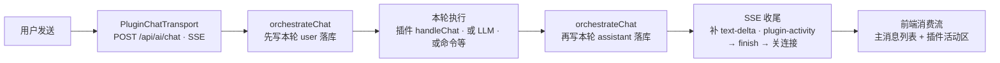
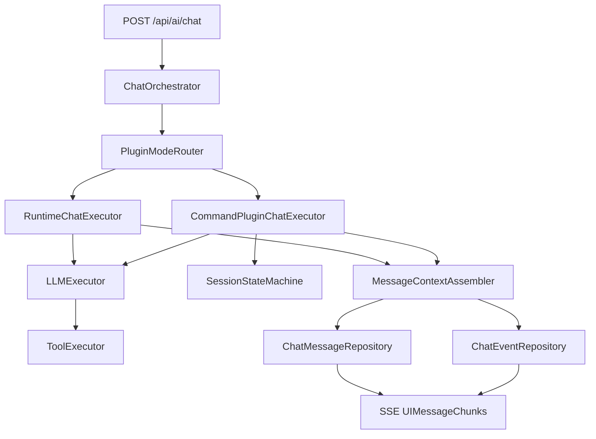

# chat消息架构设计

## 目标

- 在 `runtime_plugin` 会话中可编排调用 `command_plugin` chat。
- 保证流程解耦：路由、执行、上下文并入、持久化、事件分离。
- 为未来扩展「`command_plugin` 独立 chat 入口」预留架构空间。
- **长流程回合**：对「有明确终态、耗时可能较长」的交互（如 `/login` 扫码），支持 **同一次 `POST /api/ai/chat`（SSE）在业务未结束前保持连接**，通过同一条流推送阶段信息，**不依赖**第二条轮询/WebSocket 仅用于「异步通知」。

## 适用范围

- 本文以 `runtime_plugin` 作为当前会话承载为前提。
- `command_plugin` 被视为可调用的独立 chat 执行单元（内核）。

---

## 单线 Chat 回合流程（当前实现）

**约定**：管理台 Chat 以 **`POST /api/ai/chat` + `Accept: text/event-stream`** 为主路径；**一次用户发送 = 一次 HTTP 会话 = 一条 SSE**，中间不换第二条「进度连接」。`plugin-activity` 与主回复 `text-delta` **同一条 SSE**，前端仅**分流展示**（主线程消息 vs 插件活动区），不改变单线语义。

**与实现对应关系（便于对照代码）**

| 步骤 | 位置 |
|------|------|
| B | `host-console`：`PluginChatTransport` → `postAiChatStream` |
| C、E | `host-api`：`orchestrateChat`（`ai-chat.service.ts`）+ `appendChatMessage` |
| D | `executeRuntimeDefault` / `executeCommandPlugin` / `sendPluginChat`；插件内 `handleChat`，可 `emitPluginActivity`、`return` / `{ reply, persist }` |
| F | `host-api`：`ai-chat.routes.ts`（SSE `writeChunkSse`） |
| G | `postAiChatStream`：`plugin-activity` → `onPluginActivity`，其余 → `UIMessageChunk` → assistant-ui |

---

## 需求整理（长流程 Chat）

### 用户侧行为

1. 用户在前端发起一次 **Chat 请求**（非流式 JSON 或 **流式 SSE**，`Accept: text/event-stream`）。
2. 用户输入触发插件逻辑（例如 `/login`），进入 `weixin-bridge` 的 `handleChat`（或经编排后的等价路径）。
3. 登录过程中存在：**轮询/等待二维码失效与刷新、扫码、在手机上确认** 等阶段，可能持续数十秒至数分钟。

### 产品约束（与「异步通知」方案的取舍）

| 维度 | 目标设计（本文采纳） | 显式不采纳（本阶段） |
|------|----------------------|----------------------|
| 连接模型 | **单回合单长连接**：一次请求对应的 SSE **在整段业务完成前不结束**；中间状态通过 **同一条 SSE**（含 `plugin-activity`）输出 | 短请求立即返回 + 仅靠后台写库补 UI + 前端**另开轮询/第二条长连接** |
| 并发 | **同一前端 Chat 会话**同一时刻只跑一个「未结束的长回合」（产品约束；与 Node 多用户并发不矛盾） | 同一 UI 上叠多个未结束的阻塞式长回合 |
| 状态可见性 | 二维码刷新、已扫码、确认中等以 **SSE 事件或增量文本** 推给前端 | 仅依赖用户手动刷新页面才看到中间态 |

### 工程必须兜底的约束

- **有界时长**：服务端必须配置最大等待时间（如 `loginWaitTimeoutMs`），超时在流内返回错误/结束帧，避免连接永久悬挂。
- **中间空闲与代理**：长时间无 LLM token 时，中间可能仅有业务事件；需 **SSE 心跳或注释帧**（`: ping`）或定期 noop chunk，降低被网关/Nginx/CDN 空闲掐断的概率。
- **资源与取消**：客户端断开时应 **中止** 后台等待（`AbortSignal` 或等价），避免泄漏 `waitQr` 等挂起任务。
- **并发编排隔离**：同一 `pluginId + sessionId` 必须经过 **会话级队列** 串行执行（FIFO），防止 Web 与微信通道并发触发时的状态竞争与消息乱序；不同会话可并行。

---

## SSE 单回合长连接模型（设计决策）

### 语义定义

- **一次 Chat 回合（Turn）**：从宿主收到本轮用户消息开始，到本轮 **最终回复（或错误）** 在流上写完并 `finish` 为止。
- **长回合（Long-turn）**：本轮执行路径中需 **await** 外部人类操作或外部系统（扫码、审批等），耗时可能超过普通 LLM 首包时间；**仍属于同一 Turn**，不拆成「先关流、再靠别通道补齐」。

### 与编排层的关系

- `ChatOrchestrator`（`orchestrateChat`）在 SSE 模式下应能 **持有** `stream` 回调直至长逻辑结束；插件或执行器在阶段变化时调用 **`onTextDelta` / 扩展的 `onPluginEvent`**（见实现方案）向 `reply.raw` 写 chunk。
- **连接结束时机**：仅在 `orchestrateChat` 整链 `await` 完成（成功或失败）后，路由层写入 `text-end` → `finish-step` → `finish` 并 `res.end()`（与现有 `ai-chat.routes.ts` 骨架一致，但 **结束点**从「仅 LLM 流结束」延后到「含插件长等待结束」）。

### 与持久化（DB）的关系

- **插件 `handleChat`**：返回 **`string` 或 `{ reply, persist? }`**；**`persist`** 由 **`sendPluginChat`** 校验 `sessionId` 前缀后统一 **`appendChatMessage`**；插件 **ctx 不再提供 `appendMessage`**。  
- **`plugin-activity` SSE**：默认**不落库**、**不进入 LLM `messages`**。  
- 中间态若需可恢复历史，可后续增加「仅事件表」或显式 `persist` 策略，避免与主 assistant 文本双源矛盾。

---

## 架构分层

### 1) Orchestration（编排层）

- `ChatOrchestrator`
  - 统一处理 `POST /api/ai/chat` 请求。
  - 组织 Pre-process / Execute / Post-process。
  - **（扩展）** SSE 模式下协调 **长回合** 生命周期与 `reply` 写入节奏。
  - **（并发控制）** 在编排入口增加 session-level queue（key=`pluginId+sessionId`），确保同会话串行。

- `PluginModeRouter`
  - 根据插件类型与模式决定执行路径。
  - 不允许插件 ID 特判。

### 2) Execution（执行层）

- `RuntimeChatExecutor`
  - 处理 `runtime_plugin` 默认路径（未命中命令时默认走 LLM）。
  - **（扩展）** 对声明为「长回合」的命令（如 `/login`），在 **同一次** `handleChat` 调用链内 await 完成，并向编排层暴露阶段回调。

- `CommandPluginChatExecutor`
  - 作为可复用独立内核执行 `command_plugin` chat。
  - 支持三模式：
    - `ephemeral_no_context`
    - `ephemeral_with_context`
    - `isolated_chat`

- `LLMExecutor`
  - 封装 Vercel AI SDK `streamText` 调用与模型选择。

- `ToolExecutor`
  - 统一 MCP 工具调用与策略校验。

### 3) Session/Context（会话与上下文层）

- `SessionStateMachine`
  - 管理 `normal` / `isolated` 状态切换。
  - 处理 `/close` 退出隔离。

- `MessageContextAssembler`
  - 维护显示消息与 LLM 上下文消息并入规则。
  - 结构化结果通过 `contextSummary` 并入。

### 4) Persistence/Event（存储与事件层）

- `ChatMessageRepository`
  - 持久化 `plugin_chat_messages`。

- `ChatEventRepository`
  - 持久化 `plugin_chat_events`（建议新增）。

- `EventPublisher`
  - 统一发布 `chat.* / tool.* / mode.*` 事件。

---

## 关键设计模式

- `Strategy`：按插件模式分发执行策略。
- `State`：隔离会话状态机。
- `Template Method / Pipeline`：固定三段式执行骨架。
- `Adapter`：前端 runtime 协议到后端 `/api/ai/chat` 的协议适配。
- `Repository`：存储与业务解耦。
- `Domain Event`：事件驱动扩展触发器。

---

## 消息并入规则（统一口径）

- 插件执行回流消息默认 `llmEligible=true`。
- `isolated_chat` 退出后的回流消息同样并入后续 `runtime_plugin` LLM 上下文。
- 结构化结果不直接拼接原文，使用 `contextSummary` 并入。
- 每条消息必须带来源：
  - `sourceType=runtime`
  - `sourceType=plugin` + `sourcePluginId`

---

## 流程图（架构级）

**长回合补充**：`runtimeNode` 在命中 `/login` 等路径时，可在 **未完成 waitQr 前** 持续向 `streamNode` 写出阶段 chunk（并可选写 `msgRepoNode`），`orchNode` 仅在整链完成后关闭 `streamNode`。

---

## 与当前实现的差距（截至文档编写时）

| 项 | 目标（本文） | 当前代码状态 |
|----|----------------|---------------|
| `/login` 长回合 | 在同一次 SSE 内 await 至结束，中途推送阶段 | **已落地**：`emitPluginActivity` → SSE `plugin-activity`；`waitQr` 在 `handleChat` 内同步 await；已移除 **`startAsyncLoginWatcher`** |
| 非 SSE 的 `/login` | 明确降级策略 | **已落地**：无 `emitPluginActivity` 时返回提示，要求 `Accept: text/event-stream` 或管理台流式 Chat |
| 账号会话首条欢迎 | 用户切换会话后可见 | **`handleChat` 返回 `persist[]`**，由 **`sendPluginChat` 统一 `appendChatMessage`**；插件内不再注入 `appendMessage` |
| 编排层事件类型 | 可选规范化 `plugin_phase` | **已落地**：同一条 SSE 上增加 **`type: plugin-activity`** chunk（`phase` + `data`）；前端在 `postAiChatStream` 中**分流**，不进入 `UIMessageChunk` / assistant-ui 消息列表；**不入库、不进入 LLM `messages`** |

---

## 实现方案（分阶段）

### 阶段 A：编排与传输（宿主 host-api）

1. **扩展 `OrchestrateChatInput.stream`**（`ai-chat.service.ts`）  
   - 在现有 `onStart` / `onTextDelta` 之外增加可选：  
     - `onPluginPhase?: (payload: { phase: string; data?: Record<string, unknown> }) => void`  
     - 或统一 `onStreamEvent?: (chunk: HostStreamChunk) => void`  
   - 由 `writeChunkSse` 写入 **与 assistant-ui 兼容** 的 `event: chunk` + `type` 扩展（需在 `ai-chat.routes.ts` 与前端解析器对齐）。

2. **`ai-chat.routes.ts`（SSE）**  
   - 长回合期间定时写 **SSE 注释心跳**（如每 15–30s `: ping\n\n`），避免代理断连。  
   - 将 `request.raw.setTimeout(0)` 与 **业务超时** 区分：业务超时主动 `error` + `end`。

3. **`sendPluginChat` / `PluginChatContext`**  
   - 已实现 **`emitPluginActivity` / `emitAssistantDelta`**（经 `stream`）；**`persist`** 由宿主在 `handleChat` resolve 后落库。  
   - 保持 **禁止插件特判**：协议驱动，不写死 `weixin-bridge`。

4. **取消与单回合**  
   - `Fastify`/`request.raw` 监听 `close` / `aborted`，向 `orchestrateChat` 传入 `AbortSignal`，插件 `waitQr` 支持中止（需 openclaw-weixin 侧配合时可分步）。

5. **会话级队列（强建议）**
   - 在 `orchestrateChat` 外围引入按 `pluginId+sessionId` 分区的 FIFO 队列。
   - 同会话串行，不同会话并行；避免并发覆盖 `chat_sessions` 与 `plugin_chat_messages` 时序。
   - 单进程版本先落地；多实例时再替换为分布式锁/租约。

### 阶段 B：插件（weixin-bridge）

1. **`/login` 改为同步长路径（在 SSE 场景）**  
   - 当 `ctx` 提供 `emitPhase`（或等价）且宿主声明为流式回合：`await waitQr(..., { onStatus })`，在 **onStatus 内调用 emitPhase**，不再依赖后台 `startAsyncLoginWatcher` 写中间态（或仅终态落库）。  
   - 非 SSE（JSON 一次）路径：可保持短答 + 轮询文档说明，或统一返回「请使用流式客户端」。

2. **与 `bridge-adapter` / `waitQr`**  
   - `onStatus` 映射到 **`emitPluginActivity`**；跨会话欢迎语走 **`persist`**。

### 阶段 C：前端（host-console）

1. **`postAiChatStream` / `ai-05`（或统一 Chat 容器）**  
   - 解析新增 `chunk.type`（如 `plugin-phase`），更新 UI（二维码 URL、提示文案）。  
   - **禁止**在长回合进行时发起第二条并行的同会话 `postAiChat`（按钮禁用或队列化）。

2. **错误与超时**  
   - 展示 SSE `event: error` 与连接断开原因；超时 copy 与重试入口。

### 阶段 D：文档与契约

1. 更新 `weixin_bridge_api_contract_微信桥接口契约.md`（若存在）中 `/login` 与 **流式阶段事件** 的 payload 列表。  
2. 在 `AGENTS.md` 或插件规范中注明：**长回合推荐 SSE；JSON 路径行为**。

### 与 `@assistant-ui/react-ai-sdk` / Vercel AI `UIMessageChunk`

- **`ai` 包**的 `UIMessageChunk` 是**固定联合类型**（含 `text-delta`、`tool-input-start`、以及泛型扩展的 **`data-${NAME}`** 等）。把任意自定义 `type` **直接 enqueue** 进 `useChat` 的流时，若类型不匹配，存在被忽略或类型报错的风险。
- **当前实现**：`plugin-activity` **不**作为 `UIMessageChunk` 进入 `ReadableStream`；在 `postAiChatStream` 内消费后交给 **`onPluginActivity` → React state**，由 `Ai05` 在**主线程列表上方**单独渲染「插件活动」区。主列表仍仅由标准 `text-delta` / `finish` 等驱动，**因此不会进入 LLM 上下文**（与 `buildWithContextWindow` 使用的消息来源无关）。
- **若未来**要把活动收进同一条 assistant 消息：可为 `UIMessage` 声明 **`data-*` 部件**（见 `ai` 的 `DataUIMessageChunk` / `UIDataTypes`），再在 assistant-ui 侧做 **MessageFormatAdapter** 或自定义 part 渲染；属后续迭代。

### 验收建议（DoD）

- 单次 `/login` + SSE：连接在扫码全流程结束前 **不** `finish`。  
- 至少收到：初始二维码 →（可选）刷新 → 已扫码 → 成功或失败终态。  
- 断开浏览器标签后，服务端等待逻辑 **在合理时间内** 结束，无大量悬挂 Promise。

---

## 最小落地路径（与上文阶段对应）

1. 阶段 A 完成 **emit 通道 + 心跳 + Abort** 后再改插件，避免插件先改却无出口。  
2. 阶段 B 将 `/login` 迁入长回合模型；其他命令可仍为短答。  
3. 阶段 C 消费新 chunk 类型。  
4. 阶段 D 同步契约与清单字段（若采用 manifest 声明长回合）。

---

## 扩展点（后续）

- `command_plugin` 独立 chat 入口可直接复用同一执行内核。
- `EventPublisher` 后接 Workflow/Scheduler 即可实现自动触发链。
- ToolExecutor 可按会话作用域切换 MCP 工具集（normal/isolated）。
