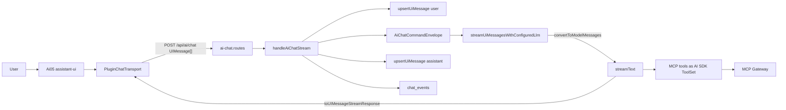
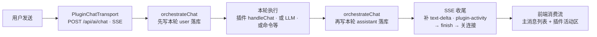
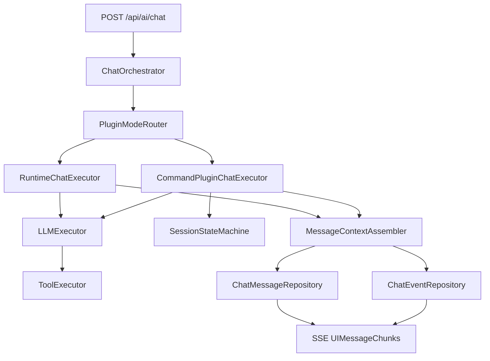

# Chat 消息架构设计

本文是宿主 Chat 主链路的约束文档。后续开发必须以 **AI SDK v6 `UIMessage` 协议 + assistant-ui runtime** 为标准，不再回到自定义 runId、手写 SSE chunk、工具输出文本化、activity replay 的旧路线。

## 目标

- 前端、后端、LLM、MCP 工具、持久化统一使用 AI SDK v6 的 `UIMessage` / `UIMessage.parts` 语义。
- 工具调用必须作为 AI SDK tool part 进入流和历史，禁止伪造成 assistant 文本。
- 用户可见消息与审计事件分离：`plugin_chat_ui_messages` 保存 UI 消息，`chat_events` 保存排障/审计事件。
- 前端只消费 assistant-ui runtime 的标准消息流，不手写 `UIMessageChunk` 生命周期。

## 标准链路总览



## 每一步执行文件与职责

### 1. 前端运行时创建

文件：`apps/host-console/src/components/ai-05.tsx`

核心方法：

- `Ai05()`
  - 创建 `PluginChatTransport`。
  - 调用 `useChatRuntime({ transport, messages, onFinish })`。
  - 通过 `AssistantRuntimeProvider` 把 runtime 提供给 assistant-ui primitives。
- `Ai05Composer()`
  - 维护输入框。
  - 调用 `aui.composer().setText()` 与 `aui.composer().send()` 进入 assistant-ui 发送管线。
- `Ai05AssistantMessage()`
  - 渲染 `message.parts`。
  - 文本使用 Markdown 渲染。
  - reasoning 与 tool part 只做展示，不改写消息协议。

要求：

- UI 层只能渲染 `parts`，不得把 tool/reasoning/data part 拼成 `content` 再发给后端。
- `onFinish` 只做界面侧刷新提示，例如刷新会话列表，不负责保存消息。
- 若要新增 tool UI，只新增 part renderer，不改 transport 协议。

### 2. 前端 Transport

文件：`apps/host-console/src/features/chat/runtime/plugin-chat-transport.ts`

核心类：

- `PluginChatTransport extends AssistantChatTransport`
  - `api` 固定指向 `${VITE_API_BASE_URL}/api/ai/chat`。
  - 通过请求头传递：
    - `X-Wclaw-Plugin-Id`
    - `X-Wclaw-Session-Id`
  - 流解析、取消、消息格式由 `AssistantChatTransport` 与 AI SDK 处理。

要求：

- 禁止恢复 `POST /api/ai/runs` + `GET /api/ai/runs/:id/stream` 的自定义双请求模式。
- 禁止在前端实现 `parseSseBlock`、`toUiMessageChunk`、断线补 `finish` 等逻辑。
- 若需要新增请求参数，优先使用请求 body 中的标准字段或明确的 header，不修改 `UIMessage` 结构。

### 3. 历史加载

文件：

- `apps/host-console/src/features/chat/hooks/use-plugin-chat-timeline-bootstrap.ts`
- `apps/host-console/src/lib/api/plugin-chat.api.ts`
- `apps/host-api/src/services/plugin-chat/plugin-chat-history.service.ts`
- `apps/host-api/src/repositories/plugin-chat.repository.ts`

核心方法：

- 前端 `usePluginChatTimelineBootstrap(pluginId, sessionId)`
  - 调用 `getPluginChatHistoryTimeline()`。
  - 直接接收后端返回的 `UIMessage[]`。
  - 不再经过 `timelineToUiBootstrap`。
- 后端 `getPluginChatHistoryTimeline()`
  - 校验 session。
  - 调用 `listUiMessages()`。
  - 返回 `{ pluginId, sessionId, limit, messages }`。
- 仓储 `listUiMessages()`
  - 从 `plugin_chat_ui_messages.ui_message_json` 读取完整 `UIMessage`。

要求：

- 历史恢复的唯一权威数据源是 `ui_message_json`。
- 禁止从 `content + activity chunks` replay 出 `parts`。
- 禁止让 `chat_events` 参与 UIMessage 重建。

### 4. 路由入口

文件：`apps/host-api/src/routes/ai-chat.routes.ts`

核心方法：

- `registerAiChatRoutes()`
  - 注册 `POST /api/ai/chat`。
  - 调用 `validateAiChatBody()`。
  - 把流式处理委托给 `handleAiChatStream()`。
  - 注册 `GET /api/ai/events` 供审计查询。

要求：

- routes 只做路由映射、基础校验和响应包装。
- 不在 routes 中写 LLM、MCP、持久化或流式拼装逻辑。
- `POST /api/ai/chat` 是管理台 Chat 主入口，不再新增并行主入口。

### 5. 请求校验

文件：`apps/host-api/src/routes/ai-chat-validation.ts`

核心方法：

- `validateAiChatBody(body, headers)`
  - 校验 `pluginId`、`sessionId` 可从 body 或 header 取得。
  - 校验 `messages` 为非空数组。
  - 校验每条消息有 `id`、`role`、`parts`。

要求：

- 后端入口接收标准 `UIMessage[]`，不得要求前端额外提供扁平 `content`。
- 若新增自定义 data part，必须先定义类型与转换策略，再调整校验。

### 6. Chat 流控制器

文件：`apps/host-api/src/controllers/ai-chat-stream.controller.ts`

核心方法：

- `handleAiChatStream(request, reply, pluginRuntime)`
  - 从 header/body 解析 `pluginId` 与 `sessionId`。
  - 调用 `persistIncomingMessages()` 保存本轮已提交的 user/assistant 历史。
  - 用 `extractLastUserMessage()` 读取本轮用户文本，用于命令路由判别。
  - 调用 `AiChatCommandEnvelope.handler()` 选择编排路径。
  - 默认 LLM 路径：
    - 构造 MCP `ToolSet`。
    - 调用 `streamUiMessagesWithConfiguredLlm()`。
    - 使用 `result.toUIMessageStreamResponse({ originalMessages, onFinish })` 返回标准流。
    - `onFinish` 保存完整 assistant `UIMessage`。
  - 非默认 LLM 路径：
    - 调用 `orchestrateChat()`。
    - 用 `createTextStreamResponse()` 生成标准文本流。

中断处理：

- `request.raw.on("close")` 触发 `AbortController.abort()`，传给 `streamText`。
- `onFinish` 即使 `isAborted=true`，只要已有可保存的 `responseMessage.parts`，也必须落库。
- 中断落库消息需带 `metadata.cancelled = true`。
- 中断审计事件写为 `chat.response.cancelled`。

要求：

- 不手写 `text-start` / `text-delta` / `finish` 的 LLM 主路径，LLM 主路径由 `toUIMessageStreamResponse()` 生成。
- 只有非 LLM/同步文本结果可以用 `createTextStreamResponse()` 转成最小标准流。
- 不把工具结果写成 `[tool ...] success` 文本。

### 7. 流响应辅助

文件：`apps/host-api/src/controllers/ai-chat-stream-response.controller.ts`

核心方法：

- `sendWebResponse(reply, response)`
  - 将 Web `Response` 桥接到 Fastify `reply.raw`。
  - 因 `reply.hijack()` 会绕过 Fastify CORS 插件，必须补：
    - `Access-Control-Allow-Origin`
    - `Access-Control-Allow-Credentials`
    - `Vary: Origin`
- `createTextStreamResponse()`
  - 将普通文本结果转为最小 AI SDK UIMessage stream。
  - 同时保存对应 assistant `UIMessage`。
- `hasPersistableParts()`
  - 判断中断/完成时是否有可保存内容。
- `withCancelledMetadata()`
  - 给中断消息补 `metadata.cancelled=true`。
- `textFromUiMessage()`
  - 仅用于审计或摘要，不作为 LLM 上下文权威来源。

要求：

- CORS 头必须在 hijack 流响应中显式保留。
- 该文件只处理响应桥接和最小消息辅助，不引入编排决策。

### 8. LLM Runtime

文件：`apps/host-api/src/services/llm/llm-runtime.service.ts`

核心方法：

- `streamUiMessagesWithConfiguredLlm(input)`
  - 读取 LLM 配置。
  - 合并全局 `systemPrompt` 与本轮 `system`。
  - 调用 `await convertToModelMessages(input.messages)`。
  - 调用 `streamText({ model, system, messages, tools, stopWhen, abortSignal })`。
  - 返回 `streamText` result，由控制器调用 `toUIMessageStreamResponse()`。
- `generateWithConfiguredLlm()` / `streamWithConfiguredLlm()`
  - 兼容非标准旧调用路径或插件命令路径。
  - 新的管理台 Chat 主路径不得优先使用这两个扁平文本接口。

要求：

- 管理台主路径必须使用 `streamUiMessagesWithConfiguredLlm()`。
- LLM 上下文转换必须使用 `convertToModelMessages(UIMessage[])`。
- 多步工具调用必须设置 `stopWhen: stepCountIs(maxSteps)`。
- `abortSignal` 必须传入 `streamText`。

### 9. MCP 工具注入

文件：`apps/host-api/src/services/ai-chat/ai-chat-runtime-default.ts`

核心方法：

- `buildRuntimeDefaultLlmTools(manifest, mcpToolForbidden, sessionId, traceId)`
  - 读取插件 `manifest.mcp.allowedServers`。
  - 读取 MCP catalog。
  - 应用会话级禁用策略。
  - 为每个允许工具生成 AI SDK `ToolSet` 项。
  - `execute()` 内调用 `gateway.invokeTool()`。

要求：

- MCP 工具必须作为 AI SDK server-side tools 注入 `streamText`。
- 工具 schema 使用 `inputSchema`。
- 工具输出由 AI SDK 变成 tool part，不由宿主拼接进 assistant 文本。
- 禁止插件 ID 特判。

### 10. 消息持久化

文件：

- `apps/host-api/src/core/db.ts`
- `apps/host-api/src/repositories/plugin-chat.repository.ts`

核心表：`plugin_chat_ui_messages`

关键字段：

- `plugin_id`
- `session_id`
- `message_id`
- `trace_id`
- `role`
- `ui_message_json`
- `content_plain`
- `source_type`
- `source_plugin_id`
- `llm_eligible`
- `context_summary`
- `created_at`
- `updated_at`

核心方法：

- `upsertUiMessage()`
  - 保存完整 `UIMessage`。
  - `ui_message_json` 是权威展示与恢复数据。
  - `content_plain` 只作派生缓存。
- `listUiMessages()`
  - 按会话读取历史并解析 `UIMessage[]`。
- `deleteAllChatMessagesForSession()`
  - 清理当前会话消息。
- `appendChatMessage()`
  - 仅作为非 AI SDK 路径的文本消息适配器，把文本包装成最小 `UIMessage`。

要求：

- 禁止恢复 `plugin_chat_messages` 纯文本表作为主消息表。
- 禁止恢复 `plugin_chat_activity` 作为 UI replay 权威数据源。
- `chat_events` 只做审计，不进入 LLM messages。
- 数据库变更可以 breaking，但必须同步 repository 和历史加载 API。

## 最佳实践

- **协议单一**：前后端只传 `UIMessage[]`；不要再发 `{ role, content, tool-context }` 这类自定义上下文格式。
- **工具结构化**：工具调用、工具输入、工具输出必须保留为 AI SDK tool part。
- **文本只展示**：`content_plain`、`textFromUiMessage()` 只用于摘要、列表、审计，不作为重新构造 LLM 上下文的权威来源。
- **持久化最终消息**：assistant 消息在 `toUIMessageStreamResponse().onFinish` 中保存；中断时也保存已有 partial message。
- **审计旁路**：`chat_events` 可以记录 `chat.llm.called`、`chat.response.completed`、`chat.response.cancelled`，但不能被拼回 `UIMessage.parts`。
- **取消传递**：前端停止或连接断开必须传到后端 `AbortController`，再传到 `streamText`。
- **CORS 注意**：凡是使用 `reply.hijack()` 桥接 Web Response，必须显式补 CORS 响应头。
- **分层约束**：routes 保持薄层；controllers 负责 HTTP 编排；services 负责业务；repositories 负责 SQLite。

## 禁止事项

- 禁止新增或恢复 `POST /api/ai/runs`、`GET /api/ai/runs/:runId/stream` 作为管理台 Chat 主路径。
- 禁止手写 AI SDK 生命周期 chunk：`start`、`text-start`、`text-delta`、`finish-step`、`finish`，除非是在非 LLM 文本结果的最小桥接函数内。
- 禁止在前端手动解析 SSE 并强转 `UIMessageChunk`。
- 禁止把工具结果写成 `[tool xxx] success: ...` 后喂回 LLM。
- 禁止从 `chat_events` 或旧 activity 表恢复 assistant-ui 消息。
- 禁止在 host-console 中按 `pluginId === "weixin-bridge"` 等方式特判 UI/欢迎语/工具展示。
- 禁止在 services 中值导入 providers；需要实例时从组合根显式传入端口。

## 变更检查清单

修改 Chat 主链路时必须检查：

- `apps/host-console/src/features/chat/runtime/plugin-chat-transport.ts` 是否仍使用 `AssistantChatTransport`。
- `apps/host-api/src/routes/ai-chat.routes.ts` 是否仍只委托 `handleAiChatStream()`。
- `apps/host-api/src/controllers/ai-chat-stream.controller.ts` 是否仍在 `onFinish` 保存 assistant `UIMessage`。
- `apps/host-api/src/services/llm/llm-runtime.service.ts` 主路径是否仍使用 `convertToModelMessages()`。
- `apps/host-api/src/services/ai-chat/ai-chat-runtime-default.ts` MCP 是否仍作为 AI SDK `ToolSet` 注入。
- `apps/host-api/src/repositories/plugin-chat.repository.ts` 是否仍以 `ui_message_json` 为权威。
- `apps/host-console/src/features/chat/hooks/use-plugin-chat-timeline-bootstrap.ts` 是否直接加载 `UIMessage[]`。

验证命令：

```bash
pnpm --filter @wclaw/host-api build
pnpm --filter @wclaw/host-console build
pnpm lint:arch
```

手工验收：

- 多轮浏览器/MCP 工具调用后，下一轮 LLM 请求中不应出现 `[tool ...] success` 这类伪工具文本。
- 刷新页面后，历史消息应能通过 `UIMessage.parts` 恢复文本、reasoning、tool 输入和 tool 输出。
- 点击停止后，已有 assistant partial 回复应落库，并带 `metadata.cancelled=true`。
- CORS 预检与流式响应都应允许 `http://localhost:5173` 调用 `http://localhost:8787/api/ai/chat`。

---

## 附录A：历史方案（已废弃，保留参考）

> 状态：**已废弃**（暂不删除，仅归档保留）。
>  
> 口径：本文件前半段「AI SDK v6 / `UIMessage` 主链路」是当前**唯一权威规范**。  
> 以下历史内容仅用于背景追溯与迁移参考，**不得**作为新增实现依据；若与前半段冲突，一律以前半段为准。

## 目标（历史）

## 目标

- 在 `runtime_plugin` 会话中可编排调用 `command_plugin` chat。
- 保证流程解耦：路由、执行、上下文并入、持久化、事件分离。
- 为未来扩展「`command_plugin` 独立 chat 入口」预留架构空间。
- **长流程回合**：对「有明确终态、耗时可能较长」的交互（如 `/login` 扫码），支持 **同一次 `POST /api/ai/chat`（SSE）在业务未结束前保持连接**，通过同一条流推送阶段信息，**不依赖**第二条轮询/WebSocket 仅用于「异步通知」。

## 适用范围

- 本文以 `runtime_plugin` 作为当前会话承载为前提。
- `command_plugin` 被视为可调用的独立 chat 执行单元（内核）。

---

## 单线 Chat 回合流程（当前实现）

**约定**：管理台 Chat 以 **`POST /api/ai/chat` + `Accept: text/event-stream`** 为主路径；**一次用户发送 = 一次 HTTP 会话 = 一条 SSE**，中间不换第二条「进度连接」。`plugin-activity` 与主回复 `text-delta` **同一条 SSE**，前端仅**分流展示**（主线程消息 vs 插件活动区），不改变单线语义。



**与实现对应关系（便于对照代码）**

| 步骤 | 位置 |
|------|------|
| B | `host-console`：`PluginChatTransport` → `postAiChatStream` |
| C、E | `host-api`：`orchestrateChat`（`ai-chat.service.ts`）+ `appendChatMessage` |
| D | `executeRuntimeDefault` / `executeCommandPlugin` / `sendPluginChat`；插件内 `handleChat`，可 `emitPluginActivity`、`return` / `{ reply, persist }` |
| F | `host-api`：`ai-chat.routes.ts`（SSE `writeChunkSse`） |
| G | `postAiChatStream`：`plugin-activity` → `onPluginActivity`，其余 → `UIMessageChunk` → assistant-ui |

---

## 需求整理（长流程 Chat）

### 用户侧行为

1. 用户在前端发起一次 **Chat 请求**（非流式 JSON 或 **流式 SSE**，`Accept: text/event-stream`）。
2. 用户输入触发插件逻辑（例如 `/login`），进入 `weixin-bridge` 的 `handleChat`（或经编排后的等价路径）。
3. 登录过程中存在：**轮询/等待二维码失效与刷新、扫码、在手机上确认** 等阶段，可能持续数十秒至数分钟。

### 产品约束（与「异步通知」方案的取舍）

| 维度 | 目标设计（本文采纳） | 显式不采纳（本阶段） |
|------|----------------------|----------------------|
| 连接模型 | **单回合单长连接**：一次请求对应的 SSE **在整段业务完成前不结束**；中间状态通过 **同一条 SSE**（含 `plugin-activity`）输出 | 短请求立即返回 + 仅靠后台写库补 UI + 前端**另开轮询/第二条长连接** |
| 并发 | **同一前端 Chat 会话**同一时刻只跑一个「未结束的长回合」（产品约束；与 Node 多用户并发不矛盾） | 同一 UI 上叠多个未结束的阻塞式长回合 |
| 状态可见性 | 二维码刷新、已扫码、确认中等以 **SSE 事件或增量文本** 推给前端 | 仅依赖用户手动刷新页面才看到中间态 |

### 工程必须兜底的约束

- **有界时长**：服务端必须配置最大等待时间（如 `loginWaitTimeoutMs`），超时在流内返回错误/结束帧，避免连接永久悬挂。
- **中间空闲与代理**：长时间无 LLM token 时，中间可能仅有业务事件；需 **SSE 心跳或注释帧**（`: ping`）或定期 noop chunk，降低被网关/Nginx/CDN 空闲掐断的概率。
- **资源与取消**：客户端断开时应 **中止** 后台等待（`AbortSignal` 或等价），避免泄漏 `waitQr` 等挂起任务。
- **并发编排隔离**：同一 `pluginId + sessionId` 必须经过 **会话级队列** 串行执行（FIFO），防止 Web 与微信通道并发触发时的状态竞争与消息乱序；不同会话可并行。

---

## SSE 单回合长连接模型（设计决策）

### 语义定义

- **一次 Chat 回合（Turn）**：从宿主收到本轮用户消息开始，到本轮 **最终回复（或错误）** 在流上写完并 `finish` 为止。
- **长回合（Long-turn）**：本轮执行路径中需 **await** 外部人类操作或外部系统（扫码、审批等），耗时可能超过普通 LLM 首包时间；**仍属于同一 Turn**，不拆成「先关流、再靠别通道补齐」。

### 与编排层的关系

- `ChatOrchestrator`（`orchestrateChat`）在 SSE 模式下应能 **持有** `stream` 回调直至长逻辑结束；插件或执行器在阶段变化时调用 **`onTextDelta` / 扩展的 `onPluginEvent`**（见实现方案）向 `reply.raw` 写 chunk。
- **连接结束时机**：仅在 `orchestrateChat` 整链 `await` 完成（成功或失败）后，路由层写入 `text-end` → `finish-step` → `finish` 并 `res.end()`（与现有 `ai-chat.routes.ts` 骨架一致，但 **结束点**从「仅 LLM 流结束」延后到「含插件长等待结束」）。

### 与持久化（DB）的关系

- **插件 `handleChat`**：返回 **`string` 或 `{ reply, persist? }`**；**`persist`** 由 **`sendPluginChat`** 校验 `sessionId` 前缀后统一 **`appendChatMessage`**；插件 **ctx 不再提供 `appendMessage`**。  
- **`plugin-activity` SSE**：默认**不落库**、**不进入 LLM `messages`**。  
- 中间态若需可恢复历史，可后续增加「仅事件表」或显式 `persist` 策略，避免与主 assistant 文本双源矛盾。

---

## 架构分层

### 1) Orchestration（编排层）

- `ChatOrchestrator`
  - 统一处理 `POST /api/ai/chat` 请求。
  - 组织 Pre-process / Execute / Post-process。
  - **（扩展）** SSE 模式下协调 **长回合** 生命周期与 `reply` 写入节奏。
  - **（并发控制）** 在编排入口增加 session-level queue（key=`pluginId+sessionId`），确保同会话串行。

- `PluginModeRouter`
  - 根据插件类型与模式决定执行路径。
  - 不允许插件 ID 特判。

### 2) Execution（执行层）

- `RuntimeChatExecutor`
  - 处理 `runtime_plugin` 默认路径（未命中命令时默认走 LLM）。
  - **（扩展）** 对声明为「长回合」的命令（如 `/login`），在 **同一次** `handleChat` 调用链内 await 完成，并向编排层暴露阶段回调。

- `CommandPluginChatExecutor`
  - 作为可复用独立内核执行 `command_plugin` chat。
  - 支持三模式：
    - `ephemeral_no_context`
    - `ephemeral_with_context`
    - `isolated_chat`

- `LLMExecutor`
  - 封装 Vercel AI SDK `streamText` 调用与模型选择。

- `ToolExecutor`
  - 统一 MCP 工具调用与策略校验。

### 3) Session/Context（会话与上下文层）

- `SessionStateMachine`
  - 管理 `normal` / `isolated` 状态切换。
  - 处理 `/close` 退出隔离。

- `MessageContextAssembler`
  - 维护显示消息与 LLM 上下文消息并入规则。
  - 结构化结果通过 `contextSummary` 并入。

### 4) Persistence/Event（存储与事件层）

- `ChatMessageRepository`
  - 持久化 `plugin_chat_messages`。

- `ChatEventRepository`
  - 持久化 `plugin_chat_events`（建议新增）。

- `EventPublisher`
  - 统一发布 `chat.* / tool.* / mode.*` 事件。

---

## 关键设计模式

- `Strategy`：按插件模式分发执行策略。
- `State`：隔离会话状态机。
- `Template Method / Pipeline`：固定三段式执行骨架。
- `Adapter`：前端 runtime 协议到后端 `/api/ai/chat` 的协议适配。
- `Repository`：存储与业务解耦。
- `Domain Event`：事件驱动扩展触发器。

---

## 消息并入规则（统一口径）

- 插件执行回流消息默认 `llmEligible=true`。
- `isolated_chat` 退出后的回流消息同样并入后续 `runtime_plugin` LLM 上下文。
- 结构化结果不直接拼接原文，使用 `contextSummary` 并入。
- 每条消息必须带来源：
  - `sourceType=runtime`
  - `sourceType=plugin` + `sourcePluginId`

---

## 流程图（架构级）



**长回合补充**：`runtimeNode` 在命中 `/login` 等路径时，可在 **未完成 waitQr 前** 持续向 `streamNode` 写出阶段 chunk（并可选写 `msgRepoNode`），`orchNode` 仅在整链完成后关闭 `streamNode`。

---

## 与当前实现的差距（截至文档编写时）

| 项 | 目标（本文） | 当前代码状态 |
|----|----------------|---------------|
| `/login` 长回合 | 在同一次 SSE 内 await 至结束，中途推送阶段 | **已落地**：`emitPluginActivity` → SSE `plugin-activity`；`waitQr` 在 `handleChat` 内同步 await；已移除 **`startAsyncLoginWatcher`** |
| 非 SSE 的 `/login` | 明确降级策略 | **已落地**：无 `emitPluginActivity` 时返回提示，要求 `Accept: text/event-stream` 或管理台流式 Chat |
| 账号会话首条欢迎 | 用户切换会话后可见 | **`handleChat` 返回 `persist[]`**，由 **`sendPluginChat` 统一 `appendChatMessage`**；插件内不再注入 `appendMessage` |
| 编排层事件类型 | 可选规范化 `plugin_phase` | **已落地**：同一条 SSE 上增加 **`type: plugin-activity`** chunk（`phase` + `data`）；前端在 `postAiChatStream` 中**分流**，不进入 `UIMessageChunk` / assistant-ui 消息列表；**不入库、不进入 LLM `messages`** |

---

## 实现方案（分阶段）

### 阶段 A：编排与传输（宿主 host-api）

1. **扩展 `OrchestrateChatInput.stream`**（`ai-chat.service.ts`）  
   - 在现有 `onStart` / `onTextDelta` 之外增加可选：  
     - `onPluginPhase?: (payload: { phase: string; data?: Record<string, unknown> }) => void`  
     - 或统一 `onStreamEvent?: (chunk: HostStreamChunk) => void`  
   - 由 `writeChunkSse` 写入 **与 assistant-ui 兼容** 的 `event: chunk` + `type` 扩展（需在 `ai-chat.routes.ts` 与前端解析器对齐）。

2. **`ai-chat.routes.ts`（SSE）**  
   - 长回合期间定时写 **SSE 注释心跳**（如每 15–30s `: ping\n\n`），避免代理断连。  
   - 将 `request.raw.setTimeout(0)` 与 **业务超时** 区分：业务超时主动 `error` + `end`。

3. **`sendPluginChat` / `PluginChatContext`**  
   - 已实现 **`emitPluginActivity` / `emitAssistantDelta`**（经 `stream`）；**`persist`** 由宿主在 `handleChat` resolve 后落库。  
   - 保持 **禁止插件特判**：协议驱动，不写死 `weixin-bridge`。

4. **取消与单回合**  
   - `Fastify`/`request.raw` 监听 `close` / `aborted`，向 `orchestrateChat` 传入 `AbortSignal`，插件 `waitQr` 支持中止（需 openclaw-weixin 侧配合时可分步）。

5. **会话级队列（强建议）**
   - 在 `orchestrateChat` 外围引入按 `pluginId+sessionId` 分区的 FIFO 队列。
   - 同会话串行，不同会话并行；避免并发覆盖 `chat_sessions` 与 `plugin_chat_messages` 时序。
   - 单进程版本先落地；多实例时再替换为分布式锁/租约。

### 阶段 B：插件（weixin-bridge）

1. **`/login` 改为同步长路径（在 SSE 场景）**  
   - 当 `ctx` 提供 `emitPhase`（或等价）且宿主声明为流式回合：`await waitQr(..., { onStatus })`，在 **onStatus 内调用 emitPhase**，不再依赖后台 `startAsyncLoginWatcher` 写中间态（或仅终态落库）。  
   - 非 SSE（JSON 一次）路径：可保持短答 + 轮询文档说明，或统一返回「请使用流式客户端」。

2. **与 `bridge-adapter` / `waitQr`**  
   - `onStatus` 映射到 **`emitPluginActivity`**；跨会话欢迎语走 **`persist`**。

### 阶段 C：前端（host-console）

1. **`postAiChatStream` / `ai-05`（或统一 Chat 容器）**  
   - 解析新增 `chunk.type`（如 `plugin-phase`），更新 UI（二维码 URL、提示文案）。  
   - **禁止**在长回合进行时发起第二条并行的同会话 `postAiChat`（按钮禁用或队列化）。

2. **错误与超时**  
   - 展示 SSE `event: error` 与连接断开原因；超时 copy 与重试入口。

### 阶段 D：文档与契约

1. 更新 `weixin_bridge_api_contract_微信桥接口契约.md`（若存在）中 `/login` 与 **流式阶段事件** 的 payload 列表。  
2. 在 `AGENTS.md` 或插件规范中注明：**长回合推荐 SSE；JSON 路径行为**。

### 与 `@assistant-ui/react-ai-sdk` / Vercel AI `UIMessageChunk`

- **`ai` 包**的 `UIMessageChunk` 是**固定联合类型**（含 `text-delta`、`tool-input-start`、以及泛型扩展的 **`data-${NAME}`** 等）。把任意自定义 `type` **直接 enqueue** 进 `useChat` 的流时，若类型不匹配，存在被忽略或类型报错的风险。
- **当前实现**：`plugin-activity` **不**作为 `UIMessageChunk` 进入 `ReadableStream`；在 `postAiChatStream` 内消费后交给 **`onPluginActivity` → React state**，由 `Ai05` 在**主线程列表上方**单独渲染「插件活动」区。主列表仍仅由标准 `text-delta` / `finish` 等驱动，**因此不会进入 LLM 上下文**（与 `buildWithContextWindow` 使用的消息来源无关）。
- **若未来**要把活动收进同一条 assistant 消息：可为 `UIMessage` 声明 **`data-*` 部件**（见 `ai` 的 `DataUIMessageChunk` / `UIDataTypes`），再在 assistant-ui 侧做 **MessageFormatAdapter** 或自定义 part 渲染；属后续迭代。

### 验收建议（DoD）

- 单次 `/login` + SSE：连接在扫码全流程结束前 **不** `finish`。  
- 至少收到：初始二维码 →（可选）刷新 → 已扫码 → 成功或失败终态。  
- 断开浏览器标签后，服务端等待逻辑 **在合理时间内** 结束，无大量悬挂 Promise。

---

## 最小落地路径（与上文阶段对应）

1. 阶段 A 完成 **emit 通道 + 心跳 + Abort** 后再改插件，避免插件先改却无出口。  
2. 阶段 B 将 `/login` 迁入长回合模型；其他命令可仍为短答。  
3. 阶段 C 消费新 chunk 类型。  
4. 阶段 D 同步契约与清单字段（若采用 manifest 声明长回合）。

---

## 扩展点（后续）

- `command_plugin` 独立 chat 入口可直接复用同一执行内核。
- `EventPublisher` 后接 Workflow/Scheduler 即可实现自动触发链。
- ToolExecutor 可按会话作用域切换 MCP 工具集（normal/isolated）。
