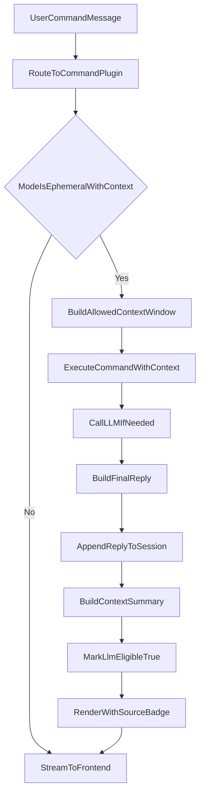

# command_plugin_ephemeral_with_context消息流程

## 适用范围

- 本文仅适用于 `command_plugin` 且执行模式为 `ephemeral_with_context` 的消息流程。
- 该流程既适用于插件独立 chat 入口，也适用于被 `runtime_plugin` 编排调用时的单步执行。

## 目标

- 明确 `ephemeral_with_context` 在“命令触发执行 + 带上下文 + 可接入 LLM”的语义。
- 明确执行结果回流与后续上下文并入策略。
- 明确来源标记与前端展示要求。

## 核心规则（已确认）

1. 执行输入规则
  - 命中 `command_plugin` 命令后，执行器可读取当前允许的上下文窗口。
  - 上下文来源由宿主统一裁剪与过滤（例如最近 N 条、按权限过滤）。
  - `command_plugin` 执行上下文是一次性的（ephemeral）：本次执行结束后默认不保留执行态，下次命令执行重开。
2. LLM 调用规则
  - `ephemeral_with_context` 可进入 LLM 推理链。
  - 若插件实现 `onCommand/handleChat` 返回结构化中间结果，可先进行预处理再喂给 LLM。
  - LLM 参数（model/temperature/tools）由宿主配置与策略控制。
3. 输出回流规则
  - 插件执行结果与/或 LLM 结果必须回流当前会话并展示。
  - 回流消息必须带来源：
    - 插件侧：`sourceType=plugin`, `sourcePluginId=<pluginId>`
    - LLM 侧：`sourceType=runtime`（或约定的 llm 来源枚举）
4. 后续上下文并入规则
  - 回流消息默认 `llmEligible=true`。
  - 结构化输出使用 `contextSummary` 并入后续 LLM 上下文，避免原始大 JSON 污染上下文。

## 消息模型建议（本流程关注字段）

- `messageId`
- `role` (`user|assistant|system`)
- `content`
- `sourceType` (`runtime|plugin`)
- `sourcePluginId`（`sourceType=plugin` 时必填）
- `llmEligible`（默认 `true`）
- `contextSummary`
- `createdAt`

## 流程图

## 前端展示要求

- 回流消息底部显示来源标签，例如：
  - `来源: plugin:workspace-echo`
  - `来源: runtime`
- 可选显示模式标签：
  - `模式: with_context`

## 实施注意事项

- 上下文窗口必须可配置，避免无限增长。
- 禁止插件 ID 特判，严格按模式与声明分流。
- services 层保持与 web 层解耦。
- 落库记录 `traceId/sessionId/pluginId` 便于审计。

## 建议实施阶段（最小可用）

1. 打通 `with_context` 命令执行 + 上下文窗口构建
2. 打通 LLM 调用与回流
3. 增加 `contextSummary` 并入验证与来源标签展示

