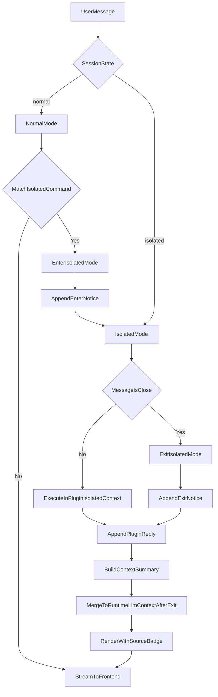

# command_plugin_isolated_chat消息流程

## 适用范围

- 本文仅适用于 `command_plugin` 且执行模式为 `isolated_chat` 的消息流程。
- 场景包括：
  - 直接进入该插件独立 chat 会话；
  - 由 `runtime_plugin` 命中命令后切换进入该插件独立 chat 上下文。

## 目标

- 明确 `isolated_chat` 的进入、会话驻留、退出规则。
- 明确 `/close` 退出行为与回流消息并入策略。
- 明确隔离期间与 runtime 工具链（MCP/LLM 配置）的关系边界。

## 核心规则（已确认）

1. 进入规则  
   - 命中 `isolated_chat` 命令后，进入该 `command_plugin` 独立 chat 上下文。
   - 进入时回流通知消息（例如：`已进入 xxx 隔离上下文`）。

2. 隔离期间执行规则  
   - 隔离期间用户消息默认路由到该插件上下文执行。
   - 隔离上下文使用插件自身会话状态，不复用 runtime 普通上下文窗口。
   - 隔离期间，`runtime_plugin` 启动时启用的 MCP 工具不生效（按隔离态规则执行）。

3. 退出规则  
   - 收到 `/close` 后退出隔离并返回 `runtime_plugin` 上下文。
   - 退出时回流通知消息（例如：`已退出隔离上下文`）。
   - `command_plugin` 上下文为一次性执行态：退出后不保留本次执行态，下次再次进入该插件隔离会话时默认重开。

4. 回流与并入规则  
   - 隔离期间与退出时产生的回流消息都写入当前展示会话。
   - 退出后，这些回流消息默认 `llmEligible=true`，并入后续 runtime LLM 上下文。
   - 结构化输出通过 `contextSummary` 并入。

## 会话状态机建议

- `normal`
- `isolated:<pluginId>`

状态转换：
- `normal -> isolated:<pluginId>`（命中 isolated 命令）
- `isolated:<pluginId> -> normal`（收到 `/close`）

## 消息模型建议（本流程关注字段）

- `messageId`
- `role`
- `content`
- `sourceType` (`plugin|runtime`)
- `sourcePluginId`（隔离期间固定为目标插件）
- `isIsolated`（是否隔离态消息）
- `llmEligible`（退出后并入规则使用）
- `contextSummary`
- `createdAt`

## 流程图

## 前端展示要求

- 隔离期间每条消息底部显示来源：
  - `来源: plugin:<pluginId>`
- 额外显示会话状态（可选）：
  - `状态: isolated`
- 进入/退出通知消息建议用系统样式区别普通回复。

## 实施注意事项

- 必须有明确退出指令（`/close`）与状态回滚保护。
- 隔离态与普通态上下文读取必须严格隔离，防止串上下文。
- 禁止插件 ID 特判，统一按模式与状态机处理。
- 落库记录 `traceId/sessionId/pluginId/state` 便于回放与审计。

## 建议实施阶段（最小可用）

1. 实现 `normal/isolated` 状态机与 `/close` 退出  
2. 打通隔离执行与进入/退出通知回流  
3. 实现退出后消息并入 runtime LLM 上下文规则  
4. 前端增加来源与隔离态标识
