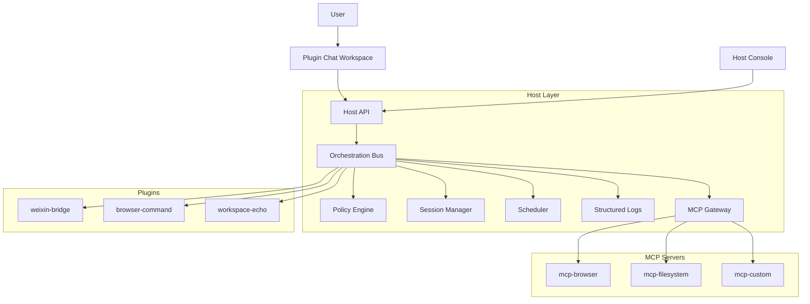

# wclaw-weixing-v3 项目蓝图（MCP Host Gateway 版）

目标：在 `v3` 阶段建立“宿主中心、插件解耦、可控编排”的工程基线。  
核心原则：**插件与宿主 100% 解耦**，插件不得直连 MCP，统一走宿主网关。

---

## 0. 关键结论（先拍板）

1. `v3` 采用重开策略，不做 `v2` 兼容包袱。
2. 宿主对外提供 MCP 探测与调用接口（插件只能调用宿主 API）。
3. 插件能力以 `capabilities` 声明，不再以 `mode` 为中心。
4. runtime_plugin 的稳定性优先于功能，必须带内存与调度治理。
5. 所有跨插件/MCP 调用必须可记录、可限权、可熔断。

---

## 0.1 Prompt2Plugin 进化引擎（插件能力进化路线）

命名：`Prompt2Plugin 进化引擎`  
定位：把“高 token 消耗的对话探索”逐步转为“低 token 消耗的插件执行”。

### 0.1.1 初衷（成本与复用）

1. 纯对话推进流程在探索期有效，但 token 消耗高。
2. 流程即便已跑通，重复执行仍会为上下文与 skill 解释持续付费。
3. 通过插件沉淀稳定步骤，可把一次性对话能力转为可复用工程资产。

### 0.1.2 三阶段路线（先跑通，再固化，再进化）

1. 探索期（LLM-first）：
   - 首次任务优先让 LLM 直接执行：网页获取、数据抽取、流程试错。
   - 目标是快速验证“步骤可行性”，而不是一次写对全部代码。
2. 固化期（Pluginize）：
   - 当流程稳定且复用频率高，将步骤转写为插件能力（chat/command/scheduled task）。
   - 由宿主统一承接权限、审计、调度、配置与会话治理。
3. 进化期（Controlled Evolution）：
   - 允许通过插件 chat 生成改进代码，但仅作为“候选版本”。
   - 候选版本必须通过校验与灰度，才能替换稳定版本。

### 0.1.3 自我进化的发布护栏（必须）

为避免 LLM 代码错误影响插件加载与线上稳定性，采用“提案制发布”：

1. 草稿隔离：新代码进入 `draft`，不得直接覆盖 `stable`。
2. 自动校验：至少通过 `build + lint:arch + manifest 校验 + 导出函数校验`。
3. 沙箱加载：在隔离环境做一次真实加载，失败即拒绝发布。
4. 用例回放：对历史已跑通任务做回放，校验结果结构与关键字段。
5. 灰度放量：先小流量验证错误率与耗时，再全量。
6. 自动回滚：发布后触发阈值（错误率/超时/内存）立即切回旧版。

### 0.1.4 失败降级策略（保证业务不中断）

- 插件加载失败：标记 `unhealthy`，不影响宿主主流程。
- 插件连续异常：触发熔断并进入 `safe_mode`。
- 熔断期间：回退到 LLM 直跑模式，待插件修复后再恢复。

### 0.1.5 落地原则（v3 执行口径）

- 原则 1：LLM 负责探索，不直接负责上线。
- 原则 2：插件负责复用，必须可测试、可审计、可回滚。
- 原则 3：宿主负责治理，确保单插件故障不外溢。

---

## 0.2 Prompt2Plugin v1（可落地实现版）

本节给出一版可以直接开工的实现方案，采用：

- **开发插件（builder）驱动**
- **草稿隔离目录生成**
- **通过 `/` 命令执行“生成-校验-测试-晋升”**

### 0.2.1 目标与边界

目标：

1. 让“需求文本 -> 可加载插件骨架 -> 可联调插件”成为标准流水线。
2. 把插件开发规范（`plugin.json`、SDK 契约、检查清单）变成自动校验，而不是人工记忆。
3. 任何生成代码默认进入草稿区，不得直接覆盖稳定插件。

边界：

- `Prompt2Plugin` 只负责“生成与治理”，不负责业务插件具体业务正确性兜底。
- 宿主仍是唯一治理中心（加载、权限、策略、审计、灰度、回滚）。

### 0.2.2 组件形态

新增一个 `command_plugin`：`plugin-dev-studio`（建议 ID：`prompt2plugin-studio`）。

职责：

1. 解析开发需求（自然语言 + 模板变量）。
2. 生成插件草稿（`plugin.json` + runtime 代码 + README + 最小脚本）。
3. 执行自动校验（结构、契约、构建、加载、清单一致性）。
4. 提供联调命令与晋升命令。

### 0.2.3 目录与隔离策略

约定目录：

```txt
plugins/
  .drafts/
    <plugin-id>/
      plugin.json
      src/
      dist/
      .p2p-meta.json
  <plugin-id>/                # 稳定目录（仅 promote 后写入）
```

规则：

1. `create/update` 只允许写入 `plugins/.drafts/<plugin-id>`。
2. `promote` 才允许把草稿同步到 `plugins/<plugin-id>`。
3. `promote` 前必须通过完整校验链。

### 0.2.4 命令集（MVP）

通过插件 chat 命令执行：

1. `/p2p.init <plugin-id> --kind runtime_plugin|command_plugin`
   - 创建草稿骨架与元信息。
2. `/p2p.spec "<需求描述>"`
   - 生成或更新需求规格（写入 `.p2p-meta.json`）。
3. `/p2p.generate`
   - 根据规格生成 `plugin.json`、`src/runtime.ts`、README、示例命令。
4. `/p2p.validate`
   - 运行校验：清单字段、SDK 契约、构建、导出类检查、可加载检查。
5. `/p2p.test`
   - 运行最小联调脚本（至少 1 条成功 + 1 条失败分支）。
6. `/p2p.promote`
   - 校验全部通过后，将草稿发布到稳定目录。
7. `/p2p.rollback <revision>`
   - 把稳定目录回退到某个已记录版本。

### 0.2.5 状态机（草稿生命周期）

`draft` 状态建议：

1. `initialized`
2. `spec_ready`
3. `generated`
4. `validated`
5. `tested`
6. `promoted`
7. `rejected`

状态迁移约束：

- `generated -> validated` 必须先通过构建和入口校验。
- `validated -> tested` 必须通过清单与契约校验。
- `tested -> promoted` 必须达到最小测试门槛。
- 任一关键校验失败直接进入 `rejected`，不得 promote。

### 0.2.6 校验流水线（必须）

`/p2p.validate` 至少执行：

1. `plugin.json` 结构与字段语义校验（`id/kind/entry/capabilities/configSchema/defaultConfig`）。
2. 运行时契约校验（入口 `export default class`，`executeTurn` 返回形状）。
3. 构建校验（可编译为 ESM 产物）。
4. 加载校验（宿主隔离加载一次）。
5. 架构规则校验（如命中扫描范围则执行 `pnpm lint:arch`）。

`/p2p.test` 至少执行：

1. 正常请求回合（返回 `text`）。
2. 异常输入回合（有可读错误提示）。
3. 可选能力缺失分支（LLM/MCP 未注入场景不崩溃）。

### 0.2.7 与现有文档对齐

`Prompt2Plugin` 必须引用并内置当前文档规范：

- `packages/plugin-sdk/docs/插件开发文档.md`
- `packages/plugin-sdk/docs/插件开发检查清单.md`
- `packages/plugin-sdk/docs/command_plugin开发检查清单.md`
- `packages/plugin-sdk/docs/runtime_plugin开发检查清单.md`

要求：

1. 生成时自动注入“必做项”注释或 TODO。
2. 校验结果按清单条目输出通过/失败。
3. `promote` 前必须“关键项全绿”。

### 0.2.8 v1 验收标准（DoD）

1. 输入一句需求，可在 3 分钟内产出可加载草稿插件。
2. 草稿插件可通过 `validate + test` 最小链路。
3. 未通过校验的草稿无法 promote。
4. promote 后稳定目录插件可被宿主发现并正常执行一轮。
5. 整个过程可追踪（traceId、pluginId、draft revision、校验记录）。

---

## 1. v3 项目骨架清单

```txt
wclaw-weixing-v3/
  apps/
    host-api/                      # 宿主 API（HTTP/SSE/WebSocket）
      src/
        app.ts
        routes/
          plugins.routes.ts
          sessions.routes.ts
          mcp.routes.ts            # MCP 探测/调用入口
          orchestration.routes.ts
        controllers/
        middlewares/
    host-console/                  # 管理台（插件管理、策略、日志、配置）
      src/
  packages/
    protocol-core/                 # 协议与类型（唯一真相）
      src/
        plugin-spec.ts
        capability.ts
        policy.ts
        session-state.ts
        error-codes.ts
    host-kernel/                   # 宿主核心（调度、策略、会话、日志）
      src/
        plugin-loader/
        session-manager/
        policy-engine/
        scheduler/
        logs/
        orchestration-bus/
    mcp-gateway/                   # MCP 代理层（探测、工具注册、调用）
      src/
        discovery/
        registry/
        invoker/
        schema-normalizer/
    plugin-sdk/                    # 插件 SDK（仅依赖 protocol-core）
      src/
        client.ts                  # 调用宿主 API 的封装
        manifest.ts                # 插件清单工具
        command.ts
        chat.ts
    plugin-runtime/                # 插件沙箱/执行容器
      src/
        runner/
        resource-guard/
        timeout-guard/
  plugins/                         # 插件仓（可单独仓库化）
    weixin-bridge/
      plugin.json
      src/
    browser-command/
      plugin.json
      src/
  docs/
    v3_项目蓝图_blueprint.md
    plugin_spec_v3_插件规范.md
    frontend_app_plan_前端方案.md
    weixin_bridge_api_contract_微信桥接口契约.md
    implementation_roadmap_实施路线图.md
    文档导航.md
    进度/
      任务TODO.md
      功能清单_status.md
  var/
    workspaces/
    logs/
```

设计约束：
- `protocol-core` 只放协议，不放业务逻辑。
- `plugin-sdk` 只依赖 `protocol-core` 与宿主公开 API，不依赖宿主内部实现。
- 插件仓可独立 CI/CD，不与宿主代码耦合发布。

---

## 2. 项目架构图（Host 提供 MCP 探测）



### 2.1 MCP 探测接口（宿主对外）

插件开发时只调用以下宿主接口：

- `GET /api/mcp/catalog`
  - 返回当前可见 MCP servers/tools（已过策略过滤）
- `GET /api/mcp/tools/:toolId/schema`
  - 返回规范化后的工具 schema（供插件渲染参数表单）
- `POST /api/mcp/invoke`
  - 由宿主代调用 MCP，插件仅提交工具名与参数
- `POST /api/mcp/validate`
  - 调用前参数校验（schema + policy）

硬规则：
- 插件内部禁止创建 MCP client。
- 插件内部禁止保存 MCP 凭据。
- 所有 MCP 调用必须带 `traceId/sessionId/pluginId` 并写入结构化日志。

---

## 3. runtime_plugin 的 “Last few GCs” 问题与治理

你判断得对：`while` 循环经常是诱因之一，但不是唯一原因。  
“Last few GCs” 本质是 V8 在高内存压力下频繁 GC，常见于以下模式：

### 3.1 典型触发源

1. `while(true)` + 高频轮询 + 无退避（CPU 与对象分配持续高压）。
2. 消息缓存/Map 不清理（长驻插件常见）。
3. 事件监听器重复注册（热重载后叠加）。
4. 大对象日志/序列化（一次 stringify 巨大 payload）。
5. Promise 未正确释放，任务并发失控。

### 3.2 必做治理（v3 基线）

- 用宿主 `scheduler` 替代插件内 `while(true)`。
- 每个轮询任务配置：`interval + jitter + timeout + maxRetry + backoff`。
- 队列并发上限（例如 `concurrency=1~4`），超过进入队列或丢弃策略。
- 所有缓存必须有 `TTL + maxSize`（LRU）。
- 插件上下文禁止持久保存完整原始消息流，只保留摘要或 ID。
- 每个插件暴露 `health()` 与 `memorySnapshot()` 给宿主巡检。

### 3.3 工程手段

- Node 启动参数：
  - `--max-old-space-size=2048`（按机器资源调整）
  - `--heapsnapshot-near-heap-limit=3`
- 监控指标：
  - `process_resident_memory_bytes`
  - `heap_used_bytes`
  - `heap_total_bytes`
  - `gc_pause_ms_p95`
  - `plugin_task_queue_depth`
- 故障策略：
  - 连续 OOM 风险时自动熔断插件并降级到 `safe_mode`。

---

## 4. 项目技术栈（当前阶段）

### 4.1 前后分离主栈（确定）

- Runtime: Node.js 20 LTS
- Language: TypeScript 5.x
- Backend API: Fastify
- Frontend: React + Vite + shadcn/ui + Tailwind CSS
- Validation: Zod + JSON Schema
- Queue/Scheduler: BullMQ 或自研轻量 scheduler
- Storage:
  - 当前阶段：`SQLite`（推荐）或文本文件（可选）
  - 缓存/租约：先内存实现，后续按压力再引入 Redis

### 4.2 为什么优先 SQLite（而不是纯文本）

- 事务一致性更好（策略、租约、插件配置写入更稳）。
- 并发读写比文本文件可靠，崩溃恢复更清晰。
- 可先本地文件化部署，后续平滑迁移 PostgreSQL。

文本文件仅建议用于：
- demo、离线单机、一次性 PoC。

### 4.3 暂不做可观测平台（阶段策略）

- 暂不接入 OpenTelemetry/Prometheus/Loki。
- 本阶段只做结构化日志（JSON Lines），保证可检索可回放。
- 日志最小字段：`time`、`level`、`traceId`、`sessionId`、`pluginId`、`action`、`result`、`costMs`。

### 4.4 增量可选（高并发阶段）

- Go sidecar（可选）：
  - `mcp-gateway` 或 `policy-evaluator` 抽离为 Go 服务
  - Node 通过 gRPC/HTTP 调用

---

## 5. 插件开发流程（100% 解耦版）

### 5.1 生命周期

1. 插件作者使用 `plugin-sdk` 初始化插件。
2. 编写 `plugin.json`（能力声明、权限、命令、会话策略）。
3. 本地调用宿主 MCP 探测接口联调（非直连 MCP）。
4. 在前端管理台配置插件参数（schema-driven 表单）。
5. 通过宿主 `validate` 接口做清单和权限校验。
6. 打包发布到插件仓（独立版本）。
7. 宿主加载并进入灰度环境。
8. 观察日志与错误率，满足阈值后全量。

### 5.2 插件与宿主接口边界

插件只允许：
- 调用宿主公开 API（HTTP/gRPC）
- 读取自身配置
- 产生结构化输出（reply/result/events）

插件禁止：
- import 宿主内部目录
- 直连 MCP server
- 访问其他插件私有存储
- 绕过策略层执行高风险动作

### 5.3 插件配置能力（前端可配置）

- 每个插件必须提供 `configSchema` 与 `defaultConfig`。
- 管理台按 schema 自动渲染配置表单（字符串、数字、布尔、枚举、对象）。
- 宿主提供配置 API：
  - `GET /api/plugins/:id/config`
  - `PUT /api/plugins/:id/config`
  - `POST /api/plugins/:id/config/validate`
- 配置变更默认热更新，无法热更新时要求插件返回 `restartRequired=true`。

---

## 6. 宿主能力清单（核心功能）

1. 插件生命周期管理：注册、加载、启停、卸载、版本校验。
2. 插件会话路由：插件 chat、命令执行、隔离上下文管理。
3. 策略与权限网关：权限判定、风险动作拦截、租约签发。
4. MCP Gateway：工具探测、schema 标准化、参数校验、代调用。
5. 编排总线：跨插件调用、MCP 调用、失败重试与熔断。
6. 配置中心：插件配置存储、校验、热更新。
7. 结构化日志中心：请求日志、调用链日志、错误日志。
8. 调度器：轮询任务、定时任务、并发与退避控制。

---

## 7. 最小 API 清单（落地优先）

- `POST /api/plugins/register`
- `POST /api/plugins/:id/validate`
- `POST /api/plugins/:id/execute-command`
- `POST /api/plugins/:id/chat`
- `POST /api/orchestration/lease/grant`
- `POST /api/orchestration/lease/revoke`
- `GET /api/mcp/catalog`
- `GET /api/mcp/tools/:toolId/schema`
- `POST /api/mcp/validate`
- `POST /api/mcp/invoke`
- `GET /api/logs/query`
- `GET /api/host/capabilities`

---

## 8. v3 首期里程碑（4 周示例）

- Week 1：`protocol-core` 冻结 + `plugin-sdk` 初版 + `mcp/catalog` 接口
- Week 2：`host-kernel` 状态机 + 策略引擎 + 结构化日志基线
- Week 3：`mcp/invoke` 全链路 + runtime_plugin 稳定性治理
- Week 4：2 个真实插件迁移 + 压测 + 文档冻结

---

## 9. DoD（完成定义）

1. 插件不依赖宿主内部代码，独立仓可构建。
2. 插件无法直连 MCP，且技术上可被阻断。
3. 任意 MCP 调用可在日志中完整追踪。
4. runtime_plugin 在压测场景无持续内存增长。
5. 插件开发文档可让新成员在 1 天内完成首个插件联调。

---

## 10. 你当前这版需求的最终落点

- 你要的“宿主提供 MCP 探测，插件只检测宿主接口”已纳入硬约束。
- 你要的“插件和宿主 100% 解耦”已落到目录、协议、流程、禁用规则。
- 你担心的 `Last few GCs` 已给出可执行治理清单，重点是 **去 while 化 + 统一调度 + 缓存边界 + 熔断降级**。
- 你要的“前后分离 + Fastify + React + shadcn、日志优先、SQLite/文本存储、前端可配插件、宿主能力清单”已全部并入本文。

